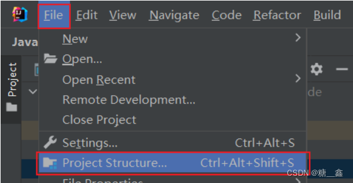
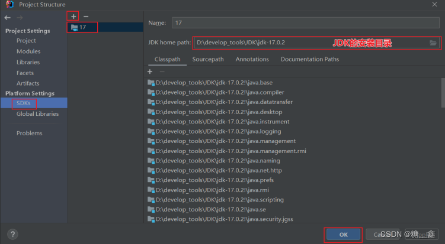
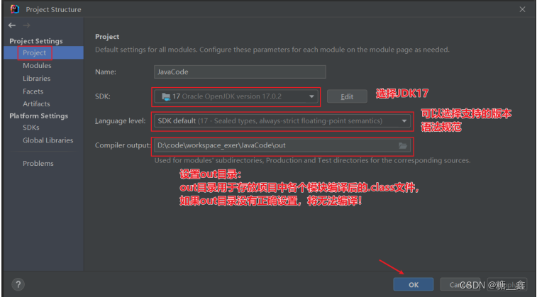

# 前言
> **視頻地址：**
> 
> 
> [07.专题4：工程中JDK的配置情况_哔哩哔哩_bilibili](https://www.bilibili.com/video/BV1CK411d7aA?p=7&vd_source=dd97ccca0358cc54d2813737943d2b54)
> 

# 项目的 JDK 设置
> **File  ⇒  Project Structure…  ⇒  Platform Settings  ⇒  SDKs**
> - 
> - 

- **注1：** SDKs 全称是 `Software Development Kit` ，这里一定是选择 JDK 的安装根目录，不是 JRE 的目录。

- **注2：** 这里还可以从本地添加多个 JDK。使用 “+” 即可实现。

# out 目录和编译版本
> File  ⇒  Project Structure…  ⇒  Project Settings  ⇒  Project
> - 

> **舉例：SDK 和 Language level 的關係**
> - `SDK` 選擇的是 JDK 17 版本。
> - `Language level` 選擇的是 JDK8 版本。
> - 這樣在編寫代碼的時候，就只能使用 JDK8 的語法，也就是無法使用 JDK9 以上的特性了。