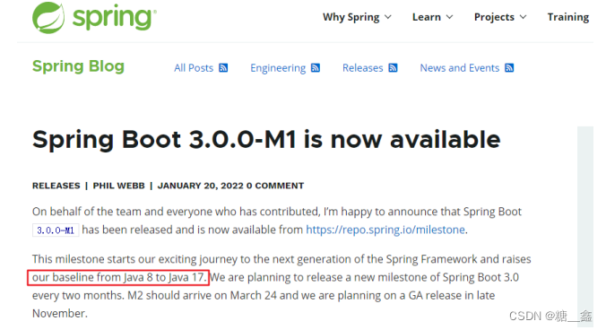

# 1. 前言
## 1.1 什麼是集成開發環境 ？
    
> **參考文章：**
> 
> 
> [什麼是 IDE? – 整合開發環境介紹 – AWS](https://aws.amazon.com/tw/what-is/ide/)
> 

集成開發環境（IDE，Integrated Development Environment ）是用於提供程序開發環境的應用程序，一般包括代碼編輯器、編譯器、調試器和圖形用户界面等工具。集成了代碼編寫功能、分析功能、編譯功能、調試功能等一體化的開發軟件服務套。所有具備這一特性的軟件或者軟件套（組）都可以叫集成開發環境。如微軟的Visual Studio系列。
    
## 1.2 為什麼選擇 IDEA 2022.x ？   
> **參考文章：**
> 
> 
> [IntelliJ IDEA 2022 最新版发布，这次真的追不动了。。-CSDN博客](https://blog.csdn.net/youanyyou/article/details/125839618)
> 
> [为何选择 IntelliJ IDEA 享受高效的 Java 开发_为什么要使用idea-CSDN博客](https://blog.csdn.net/tgs2033/article/details/125670810)
> 
    
> **支持 Spring 6 和 Spring Boot 3 的特性**
> 
> 
> IntelliJ IDEA 2022.2 完全支持 Spring 6 和 Spring Boot 3 的新特性，包括新的 *@AutoConfiguration* 类和 *@ConfigurationProperties* 类。
> 

# 2. Why IDEA ?

> **【注】JetBrains官方说明：**
> 
> - 尽管我们采取了多种措施确保受访者的代表性，但结果可能会略微偏向 JetBrains 产品的用户，因为这些用户更有可能参加调查。

此外，2022年，某美国软件开发商在对近千名专业的Java开发者调研后，发布了《2022年Java开发者生产力报告》。报告提到：JetBrains 的 IntelliJ IDEA是最受欢迎的 Java IDE，占 48% ，其次是 Eclipse，占24%，Visual Studio Code 占 18%。

# 3. Why IDEA 2022.x

在Java 17正式发布之前，Java开发框架Spring率先在官博宣布，Spring Framework 6 和 Spring Boot 3 计划在 2022 年第四季度实现总体可用性的高端基线：

- Java 17+(来自 Spring Framework 5.3.x 线中的 Java 8-17)
- Jakarta EE 9+（来自Spring框架5.3.x 线中的 Java EE 7-8）

> Spring 官方说明： [https://spring.io/blog/2022/01/20/spring-boot-3-0-0-m1-is-now-available](https://spring.io/blog/2022/01/20/spring-boot-3-0-0-m1-is-now-available)
> 
> 
> 
> 

> **意味着 :**
> 
> 
> springboot3.0 是需要用 java17 和 spring6.0 为基础建设。如果从企业选型最新 springboot3.0 作为架构来说，它搭配 jdk17 肯定是标配了。
> 

> 💡 本着" `工欲善其事必先利其器` "的精神，本套课程从 IDEA 的介绍、安装、设置入手，讲解IDEA中项目的创建、快捷键与模板的使用、断点调试、常用插件等。