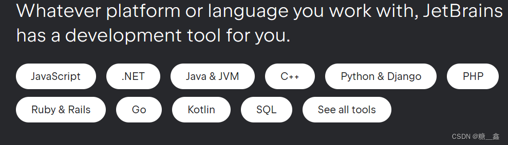
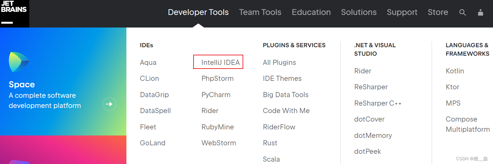

# 1. JetBrains 公司介绍
IDEA，是 [JetBrains](https://www.jetbrains.com/) 公司的产品，该公司成立于2000年，总部位于捷克的布拉格，致力于为开发者打造最高效智能的开发工具。

- 公司旗下还有其它产品，比如：
    - WebStorm：用于开发 JavaScript、HTML5、CSS3 等前端技术
    - PyCharm：用于开发 python
    - PhpStorm：用于开发 PHP
    - RubyMine：用于开发 Ruby/Rails
    - AppCode：用于开发 Objective - C/Swift
    - CLion：用于开发 C/C++
    - DataGrip：用于开发数据库和 SQL
    - Rider：用于开发.NET
    - GoLand：用于开发 Go

用于开发 Android 的 Android Studio，也是 Google 基于 IDEA 社区版进行迭代的。

# 2. IntelliJ IDEA 介绍
IDEA，全称 IntelliJ IDEA ，是 Java 语言的集成开发环境，目前已经（基本）代替了Eclipse的使用。IDEA 在业界被公认为是最好的 Java 开发工具（之一），因其 功能强悍 、 设置人性化 ，而深受Java、大数据、移动端程序员的喜爱。尤其在智能代码助手、代码自动提示、重构、J2EE支持、Ant、JUnit、CVS 整合、代码审查、创新的 GUI 设计等方面的功能可以说是超常的。

> **IntelliJ IDEA 在 2015 年的官网上这样介绍自己：**
> 
> 
> Excel at enterprise, mobile and web development with Java, Scala and Groovy,with all the latest modern technologies and frameworks available out of thebox.

# 3. IDEA的主要优势：(vs Eclipse)
## 3.1 功能强大：

- 强大的整合能力。比如：Git、Maven、Spring 等。
    -     
    
- 开箱即用的体验（集成版本控制系统、多语言支持的框架随时可用，无需额外安装插件）

# 3.2 符合人体工程学：

- 高度智能（快速的智能代码补全、实时代码分析、可靠的重构工具）。
    - .png "")    
    
- 提示功能的快速、便捷、范围广。
    - 
    
- 好用的快捷键和代码模板。
- 精准搜索。

# 4. IDEA 的下载

- [下载网址](https://www.jetbrains.com/idea/download/?section=windows#section=windows)

- IDEA 分为两个版本： 旗舰版(Ultimate) 和 社区版(Community) 。

- IDEA的大版本每年迭代一次，大版本下的小版本（如：2022.x）迭代时间不固定，一般每年3个小版本。