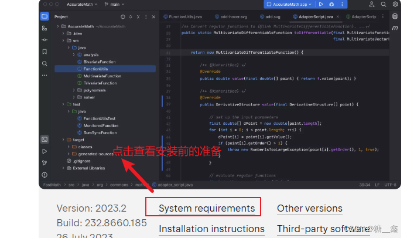
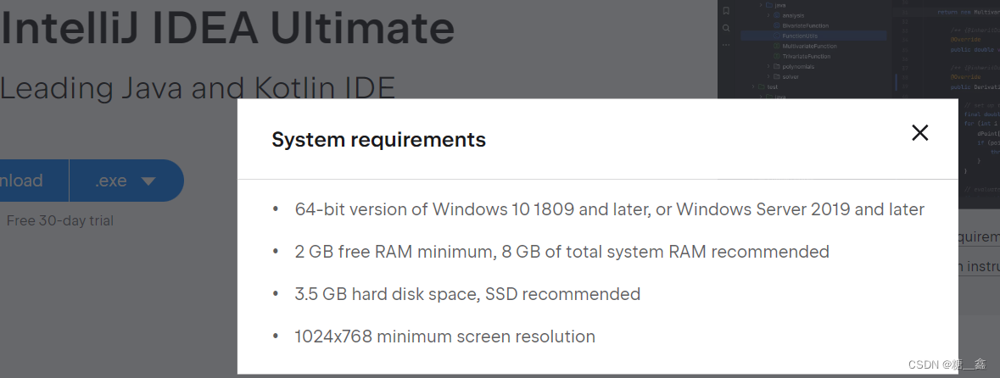
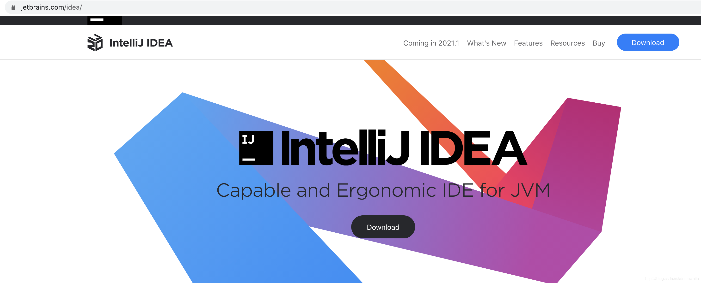
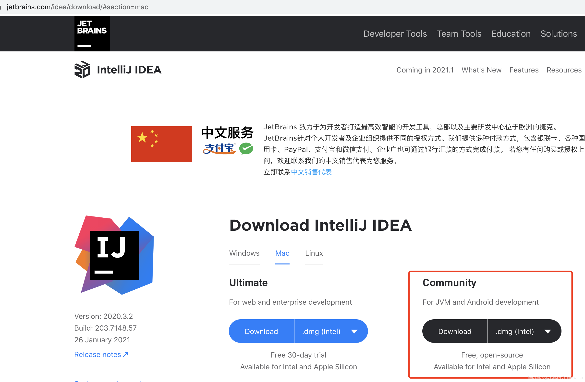
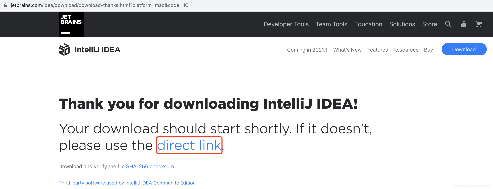
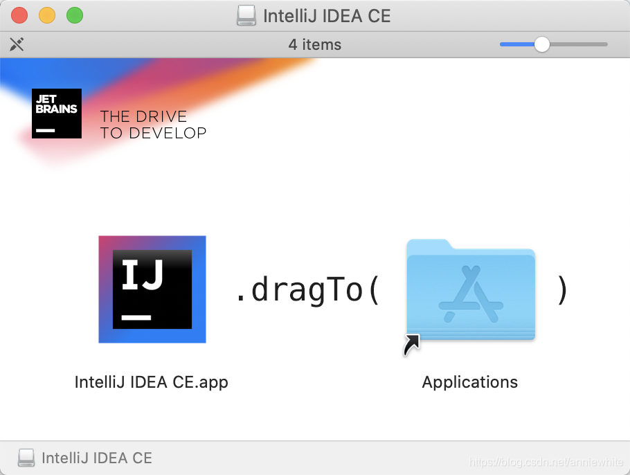
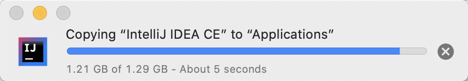
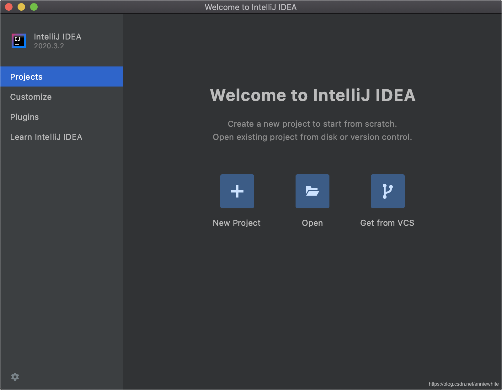
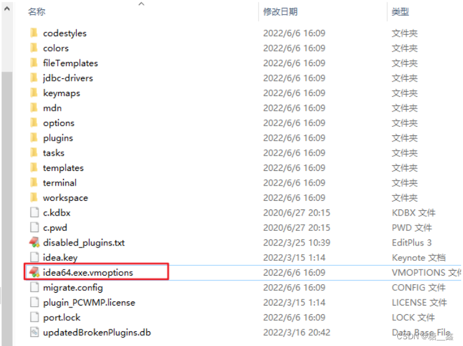

# 1. 卸載過程
> **參考文章：**
> 
> 
> [彻底卸载Mac中的IntelliJ IDEA-百度开发者中心](https://developer.baidu.com/article/details/2784855)
> 
> [在「Mac OS」上完整移除「IntelliJ IDEA」的設定檔、暫存檔](https://rickbsr.medium.com/在-mac-os-上完整移除-intellij-idea-的設定檔-暫存檔-a15911e6263e)
> 
> [Mac中如何卸载干净 IDEA_mac 卸载idea-CSDN博客](https://blog.csdn.net/qq_44807756/article/details/135498311)
> 

## 1.1 完整的卸载步骤

### 1.1.1 卸载 IntelliJ IDEA 应用程序
1. 打开 **Finder**。
2. 转到 **应用程序** 文件夹。
3. 找到 **IntelliJ IDEA**，然后将其拖动到 **废纸篓**，或者右键点击选择 **移到废纸篓**。

### 1.1.2 删除相关的配置文件和数据
#### 1.1.2.1 可以手动删除以下文件夹来清除 IntelliJ IDEA 的所有相关数据：
1. **配置文件**: `~/Library/Application Support/JetBrains/IntelliJIdea<version>`

2. **Caches 文件夹**: `~/Library/Caches/JetBrains/IntelliJIdea<version>` 

3. **Logs 文件夹**: `~/Library/Logs/JetBrains/IntelliJIdea<version>` 

4. **Plugins 文件夹**: `~/Library/Application Support/JetBrains/IntelliJIdea<version>/plugins` 

##### 1.1.1.2 也可以使用以下命令在终端中删除这些文件夹：
    
```bash
rm -rf ~/Library/Application\ Support/JetBrains/IntelliJIdea<version>
rm -rf ~/Library/Caches/JetBrains/IntelliJIdea<version>
rm -rf ~/Library/Logs/JetBrains/IntelliJIdea<version>
```

> **注意**: <version> 替换为你的 IntelliJ IDEA 版本号。
> 

### 1.1.3 删除应用支持文件和快捷方式
#### 1.1.3.1 可能还需要(手動)删除以下目录中存储的一些支持文件：
```bash
~/Library/Preferences/JetBrains
~/Library/Preferences/com.jetbrains.intellij.plist
~/Library/Saved Application State/com.jetbrains.intellij.savedState
```
    
#### 1.1.3.2 也可以使用以下命令删除这些文件和目录：
```bash
rm -rf ~/Library/Preferences/JetBrains
rm -rf ~/Library/Preferences/com.jetbrains.intellij.plist
rm -rf ~/Library/Saved\ Application\ State/com.jetbrains.intellij.savedState
```
        
### 1.1.4 完成这些步骤后，IntelliJ IDEA 应该已经完全从你的 Mac 中卸载了。

## 1.2 各個目錄的詳細解釋：

### 1.2.1 配置文件目錄

- **路徑**: `~/Library/Application Support/JetBrains/IntelliJIdea<version>`

- **內容**: 這個目錄存儲了 IntelliJ IDEA 的所有配置文件，包括用戶的個性化設置、快捷鍵、外觀主題、編譯器設置、語言支持、項目模板等。刪除這個目錄將會移除所有的個性化設置和配置。

### 1.2.2 Caches 目錄

- **路徑**: `~/Library/Caches/JetBrains/IntelliJIdea<version>`
- **內容**: 這個目錄包含 IntelliJ IDEA 生成的緩存數據，包括文件索引、編譯後的二進制文件、語法高亮數據等。這些數據有助於提升 IDE 的性能。刪除這個目錄通常不會造成問題，但會讓 IDE 下次啟動時重新生成這些緩存。

### 1.2.3 Logs 目錄

- **路徑**: `~/Library/Logs/JetBrains/IntelliJIdea<version>`
- **內容**: 這個目錄存儲了 IntelliJ IDEA 的運行日誌文件，這些文件用於記錄應用程序運行過程中的錯誤、警告、信息等。如果你需要排查 IntelliJ IDEA 的運行問題，可以參考這些日誌。刪除這個目錄會刪除所有的日誌文件。

### 1.2.4 Plugins 目錄

- **路徑**: `~/Library/Application Support/JetBrains/IntelliJIdea<version>/plugins`
- **內容**: 這個目錄存儲了你安裝的所有插件及其相關數據。刪除這個目錄會移除所有插件及其設置。

### 1.2.5 Preferences 目錄

- **路徑**: `~/Library/Preferences/JetBrains` 和 `~/Library/Preferences/com.jetbrains.intellij.plist`
- **內容**: `Preferences` 目錄保存了與應用程序相關的用戶偏好設置文件。`com.jetbrains.intellij.plist` 文件則是 macOS 用來存儲 IntelliJ IDEA 設置的屬性列表文件。這些文件包括應用程序的基本配置、窗口布局等。刪除這些文件會讓系統忘記所有這些偏好設置。

### 1.2.6 Saved Application State 目錄

- **路徑**: `~/Library/Saved Application State/com.jetbrains.intellij.savedState`
- **內容**: 這個目錄存儲了 macOS 的自動恢復狀態數據，用於在應用程序重新啟動時恢復之前的窗口和應用程序狀態。刪除這個目錄會清除 IntelliJ IDEA 的已保存狀態。

### 1.2.7 其他 JetBrains 應用共享的目錄

- **路徑**: `~/Library/Preferences/JetBrains`
- **內容**: 如果你使用其他 JetBrains 應用程序，它們的配置文件也會儲存在這個目錄下。刪除這個目錄可能會影響到其他 JetBrains 應用程序。

### 1.2.8 總結

- 如果你確定不再使用 IntelliJ IDEA，並希望徹底清除所有與其相關的數據，可以安全地刪除這些目錄。
- 如果你打算重新安裝 IntelliJ IDEA 或使用其他 JetBrains 工具，則可以保留一些配置文件和插件目錄，以便保留原有設置和插件。

# 2. 安装前的准备




- 64 位 Microsoft Windows 11、10、8
- 最低 2 GB 可用 RAM，推荐 8 GB 系统总 RAM
- 2.5 GB 硬盘空间，推荐 SSD
- 最低屏幕分辨率 1024x768

> 从安装上来看，IntelliJ IDEA 对硬件的要求 似乎不是很高 。可是在实际开发中并不是这样的，因为 IntelliJ IDEA 执行时会有大量的缓存、索引文件，所以如果你正在使用 Eclipse / MyEclipse，想通过 IntelliJ IDEA来解决计算机的卡、慢等问题，这基本上是不可能的，本质上你应该对自己的硬件设备进行升级。

# 3. 安装过程
> **參考文章：**
> - [Mac下载和安装IntelliJ IDEA（JetBrains为专业开发者提供的Java IDE）_download intellij idea for apple silicon for bette-CSDN博客](https://blog.csdn.net/anniewhite/article/details/113790739)

- **查看 MAC 电脑用的是 Intel 还是 Apple Silicon 的 CPU ？**
    - 在 Mac 上，单击菜单栏左上角的[Apple]图标，然后选择“关于本机”（About This Mac）选项。
    
    - 如果在“芯片”部分中看到Apple M1（或更高版本），则意味着使用的是带有[Apple Silicon CPU]的Mac。
    
    - 如果在“处理器”部分中看到英特尔处理器，则表示正在使用带有英特尔芯片的Mac。

# 3.1 下载 IntelliJ IDEA

1. 打开 https://www.jetbrains.com/idea/，点击 Download 按钮。
    - 
    
2. 选择 Community 版本，确认使用带有英特尔芯片的 Mac，点击 Download。
    - 
    
3. 打开如下页面，IntelliJ IDEA 便会开始自动下载。若未开始自动下载，可以点击如下红框内的 direct link。
    
    
    - 中文页面如下所示：
        
        
4. IntelliJ IDEA 下载完成，在下载文件夹内便会出现 ideaIC-2020.3.2.dmg 的文件。
    
    

# 3.2 安装 IntelliJ IDEA

1. 双击 ideaIC-2020.3.2.dmg 文件开始安装
    
    
2. 把 IntelliJ IDEA CE.app 拖入到 Applications 文件夹
    
    
3. 在Applications中可以找到IntelliJ IDEA CE.app，说明安装完成
    
    

# 3.3 打开 IntelliJ IDEA

首次打开IntelliJ IDEA后展现的第一个页面。至此，IntelliJ IDEA下载、安装和打开成功。



# 4. 闪退问题
- 问题描述 1：2022.1 启动不了，双击桌面图标，没有响应。
- 问题描述 2：进入到安装目录 `…\IntelliJ IDEA 2022.1.2\bin`，打开 CMD。输入 idea，发现报错。

- 解决办法：
    - 打开 `C:\Users\songhk\AppData\Roaming\JetBrains\IntelliJIdea2022.1\idea64.exe.vmoptions` 这个文件。
         

         
        
        
    - 内容如上所示：删除红框的数据以后，再登录即可正常进入。
        
        

> 原因：
之前使用过的比如2021.2.2版本 (破解了)。新版 IEDA 太智能了，把现有的启运参数也都复制过去了。又因为最新的 IDEA，不兼容破解程序 → `javaagent:D:\develop_tools\IDEA\IntelliJ IDEA2021.2.2\bin\jetbrains-agent.jar` 了，所以报错了，所以 JVM 结束了，所以没有启动画面，凉凉了。