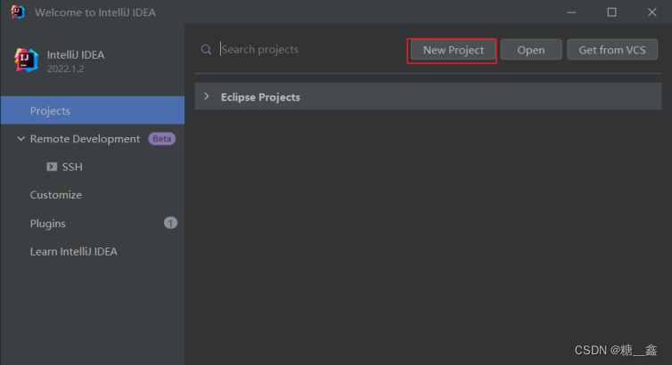
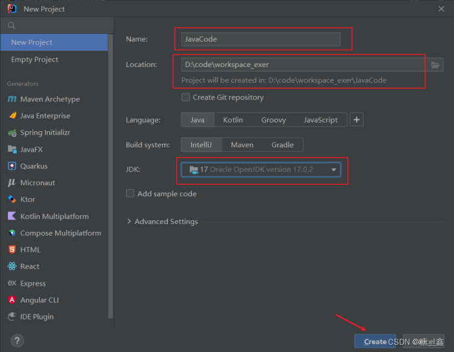
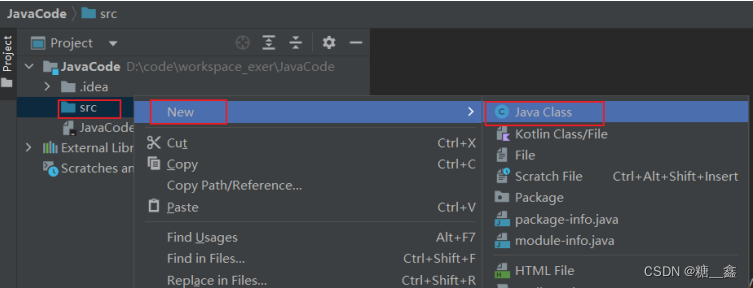
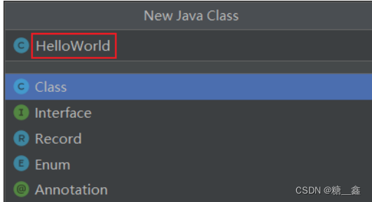
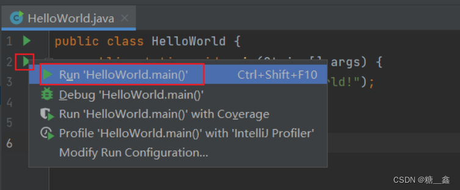
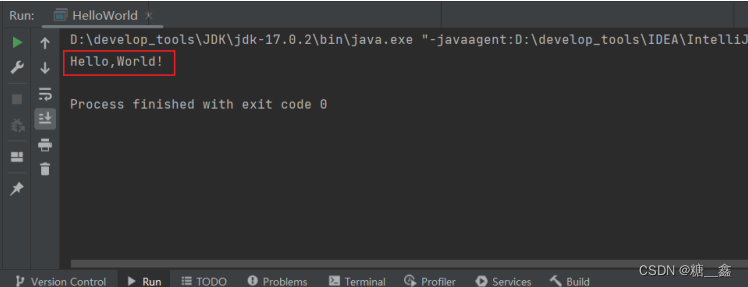

> **影片來源：**
> 
> 
> [06.专题3：HelloWorld的编写_哔哩哔哩_bilibili](https://www.bilibili.com/video/BV1CK411d7aA?p=6&spm_id_from=pageDriver&vd_source=dd97ccca0358cc54d2813737943d2b54)
> 

# 1. 新建 Project、Class
> 注意：以下举例 jdk17 来说明，别的版本只需要修改 jdk 即可。
> 

### （1）选择 “New Project” :

    
### （2）指名工程名、使用的JDK版本等信息。如下所示 :

    
### （3）接着创建 Java 类 ：



    

# 2. 编写代码

```java
public class HelloWorld {
	public static void main(String[] args) {
		System.out.println("Hello,World!");
	}
}
```

# 3. 运行


