# 1. 如何打开详细配置界面

## 1.1 显示工具栏
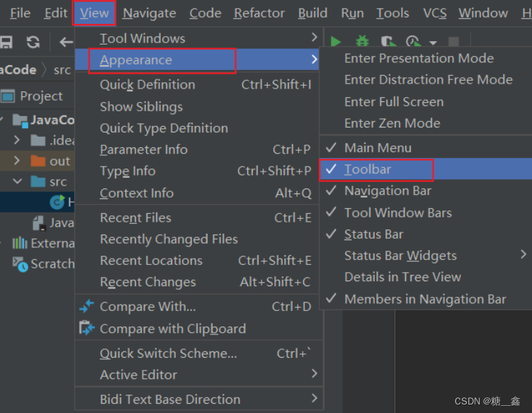

## 1.2 选择详细配置菜单或按钮
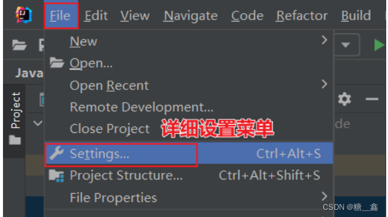

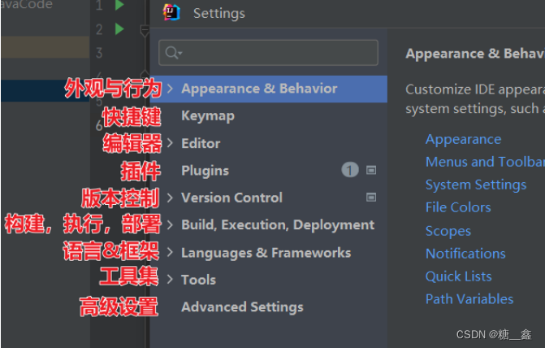

# 2. 系统设置

## 2.1 默认启动项目配置

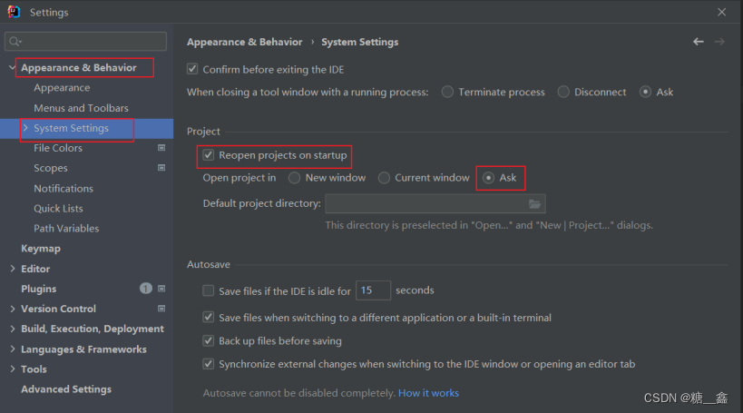

启动 IDEA 时，默认自动打开上次开发的项目？还是自己选择？

如果去掉 Reopen last project on startup 前面的对勾，每次启动 IDEA 就会出现如下界面 ：

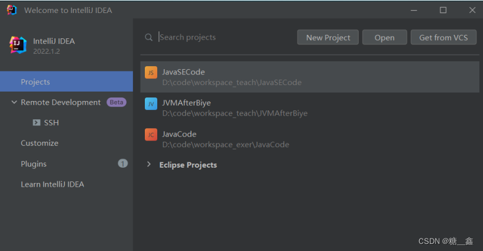

## 2.2 取消自动更新

> Settings  ⇒  Appearance & Behavior  ⇒  System Settings  ⇒  Updates
> 

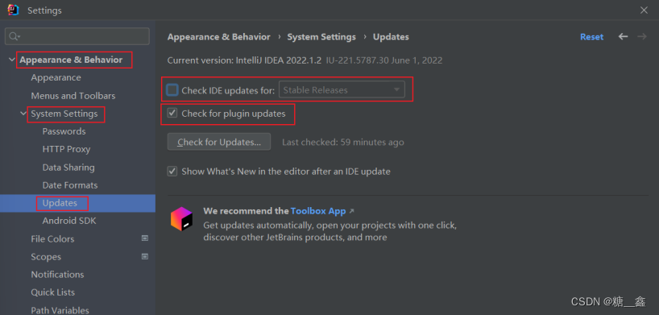

> 💡默认都打 √ 了，建议检查 IDE 更新的 √ 去掉，检查插件更新的 √ 选上。

# 3. 设置整体主题

## 3.1 选择主题
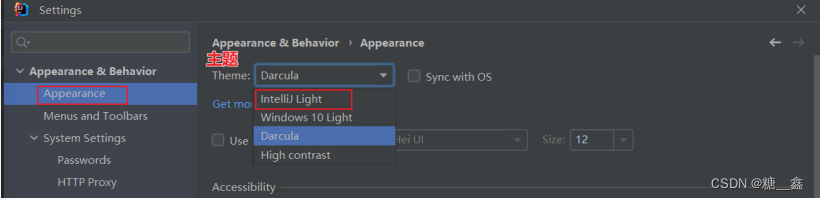

## 3.2 设置菜单和窗口字体和大小
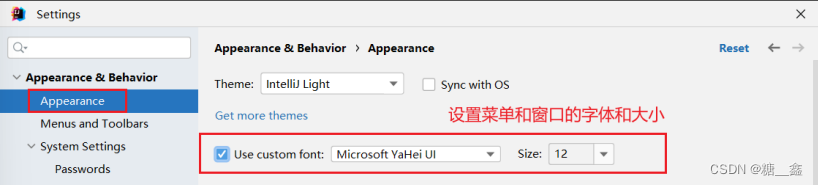

## 3.3 设置IDEA背景图
> 选择一张合适的图片作为背景，即可。

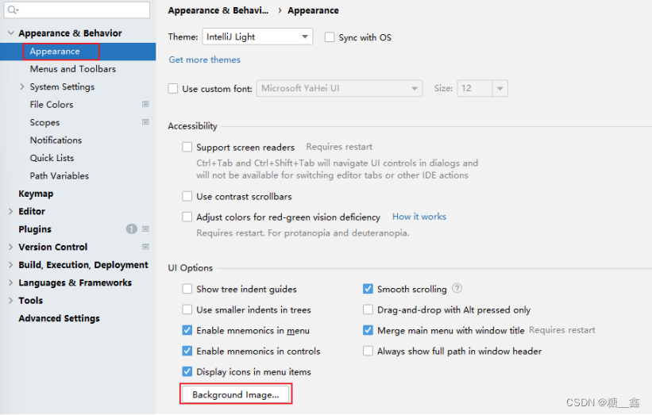


# 4. 设置编辑器主题样式

## 4.1 编辑器主题
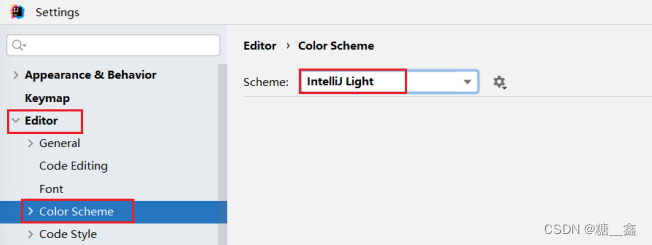

## 4.2 字体大小

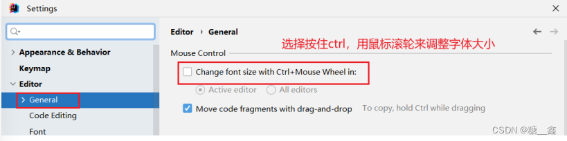

**更详细的字体与颜色如下**

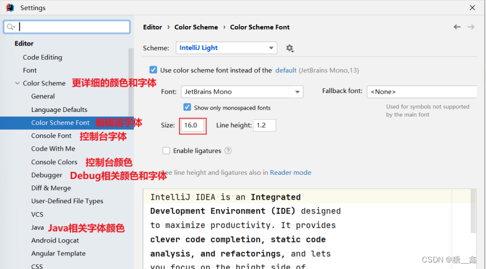

> **💡温馨提示：**
> - 如果选择某个font字体，中文乱码，可以在fallback font（备选字体）中选择一个支持中文的字体。

## 4.3 注释的字体颜色
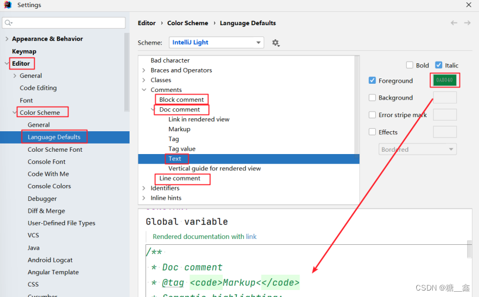

- Block comment：修改多行注释的字体颜色
- Doc Comment Text：修改文档注释的字体颜色
- Line comment：修改单行注释的字体颜色

# 5. 显示行号与方法分隔符


# 6. 代码智能提示功能

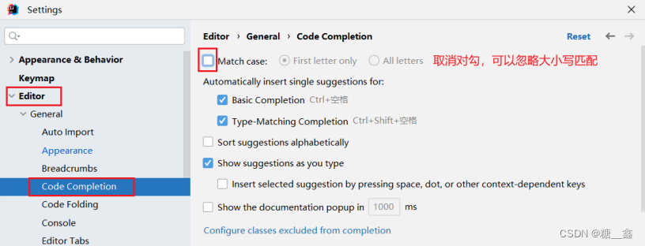

> 💡 **IntelliJ IDEA 的代码提示和补充功能有一个特性**：
> - `区分大小写` 。 如果想不区分大小写的话，就把这个对勾去掉。 `建议去掉勾选` 。

# 7. 自动导包配置

## 7.1 默认需要自己手动导包，Alt+Enter快捷键

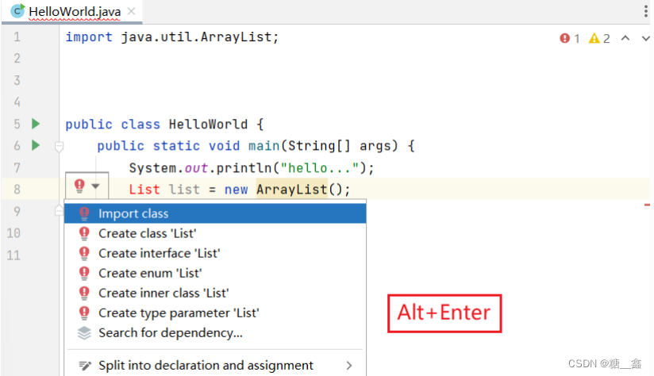

## 7.2 自动导包设置

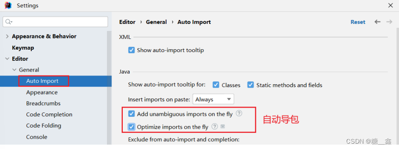

- 动态导入明确的包：Add unambiguous imports on the fly，该设置具有全局性。
- 优化动态导入的包：Optimize imports on the fly，该设置只对当前项目有效。

# 8. 设置项目文件编码

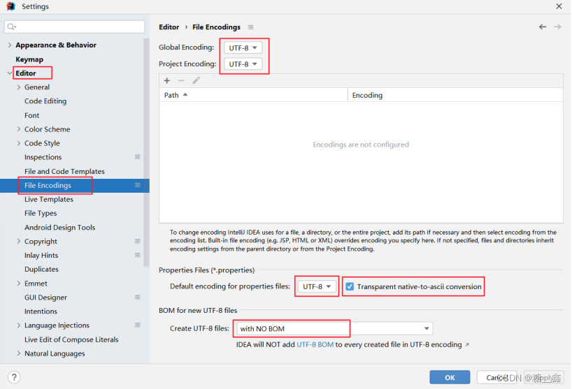

> **💡说明：** 
> - `Transparent native-to-ascii conversion` 主要用于转换 `ascii`，显式原生内容。一般都要勾选。

# 9. 设置控制台的字符编码


# 10. 修改类头的文档注释信息

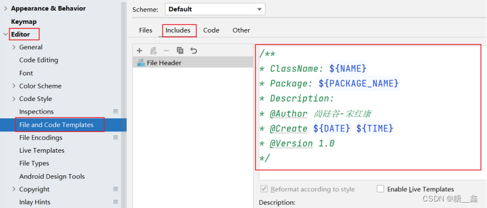

**比如**：

```java
/**
* ClassName: ${NAME}
* Package: ${PACKAGE_NAME}
* Description:
* @Author 尚硅谷-宋红康
* @Create ${DATE} ${TIME}
* @Version 1.0
*/
```

常用的预设的变量，这里直接贴出官网给的

```java
${PACKAGE_NAME} - the name of the target package where the new class or interface will
be created.
${PROJECT_NAME} - the name of the current project.
${FILE_NAME} - the name of the PHP file that will be created.
${NAME} - the name of the new file which you specify in the New File dialog box during
the file creation.
${USER} - the login name of the current user.
${DATE} - the current system date.
${TIME} - the current system time.
${YEAR} - the current year.
${MONTH} - the current month.
${DAY} - the current day of the month.
${HOUR} - the current hour.
${MINUTE} - the current minute.
${PRODUCT_NAME} - the name of the IDE in which the file will be created.
${MONTH_NAME_SHORT} - the first 3 letters of the month name. Example: Jan, Feb, etc.
${MONTH_NAME_FULL} - full name of a month. Example: January, February, etc.
```

# 11. 设置自动编译
在IntelliJ IDEA中，你可以设置保存文件后自动编译。这个功能可以让你在每次修改并保存文件时自动检查代码错误，有助于快速发现和修复问题。以下是设置保存后自动编译的步骤：

> Settings  ⇒  Build,Execution,Deployment  ⇒  Compiler
> 

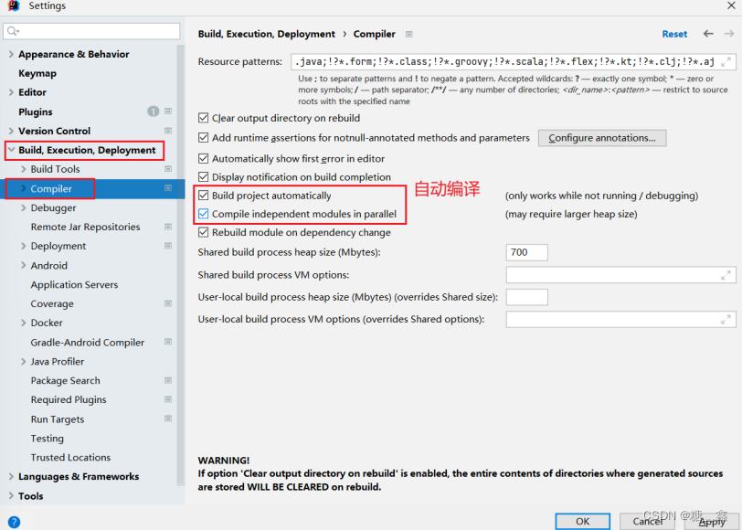

现在，每次你修改并保存文件时，IntelliJ IDEA将自动编译你的代码。如果存在编译错误，它们将在底部的`Build`工具窗口中显示出来。你可以根据需要调整自动编译的频率和选项，以满足你的开发需求。

请注意，自动编译功能可能会影响IDE的性能，特别是当项目较大或有很多文件需要编译时。因此，如果你发现IDE运行缓慢，可以考虑暂时禁用自动编译功能，或调整自动编译的选项以减少不必要的编译次数。

# 12. 设置为省电模式

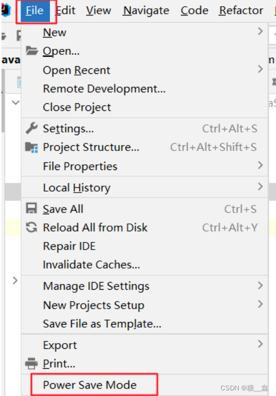

> 💡 **注意**：
> - IntelliJ IDEA 有一种叫做`省电模式`的状态，开启这种模式之后 IntelliJ IDEA 会`关掉代码检查` 和 `代码提示` 等功能。所以一般也可认为这是一种 `阅读模式` ，如果你在开发过程中遇到突然代码文件不能进行检查和提示，可以来看看这里是否有开启该功能。

# 13. 取消双击shift搜索
> **因为我们按 shift 切换中英文输入方式，经常被按到，总是弹出搜索框，太麻烦了。可以取消它。**
> - 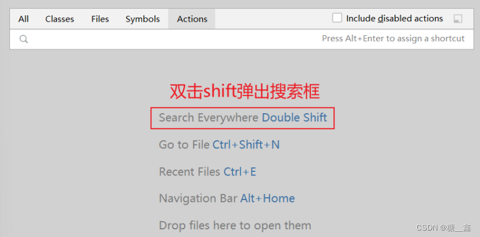

## 13.1 方式1：适用于IDEA 2022.1.2版本
> **在2022.1版本中，采用如下方式消双击shift出现搜索框：搜索double即可，勾选Disable double modifier key shortcuts，禁用这个选项。**
> - 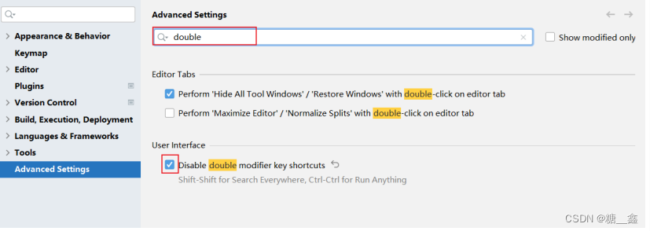

## 13.2 方式2：适用于IDEA 2022.1.2之前版本

双击 shift 或 ctrl + shift + a，打开如下搜索窗口

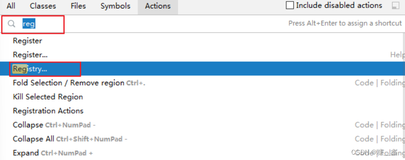

选择 registry…，找到 "ide.suppress.double.click.handler"，把复选框打上勾就可以取消双击 shift 出现搜索框了。

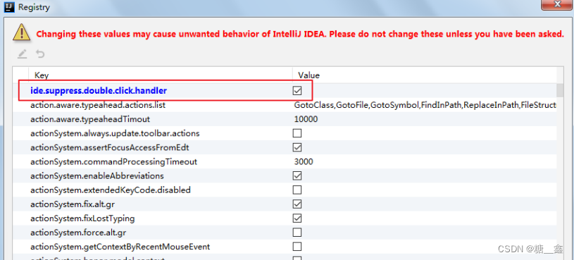

# 14. 其它设置

- **是否在单行显式编辑器选项卡（建议去掉勾选）**
    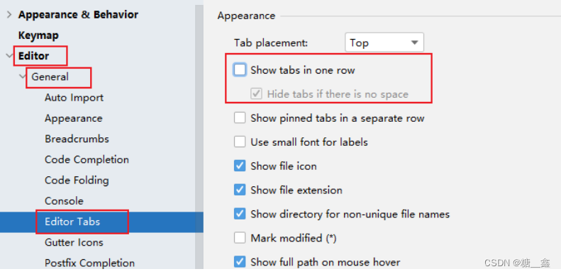
    
- **设置代码样式：比如，设置 import 显示 "*" 时的个数**
    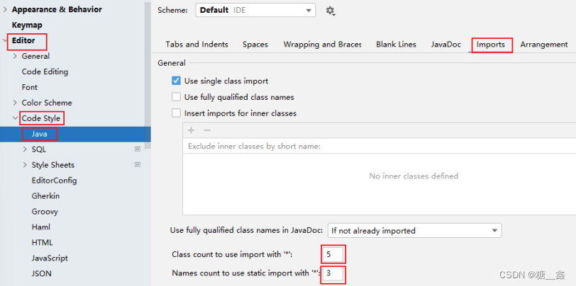