# 1. IDEA项目结构

### 层级关系：
- project(工程)  ⇒  module(模块)  ⇒  package(包)  ⇒  class(类)

### 具体的：
- 一个 `project` 中可以创建多个 `module`
- 一个 `module` 中可以创建多个 `package`
- 一个 `package` 中可以创建多个 `class`

> 💡 这些结构的划分，是为了方便管理功能代码。

# 2. Project和Module的概念
> 在 IntelliJ IDEA 中，提出了 Project 和 Module 这两个概念。

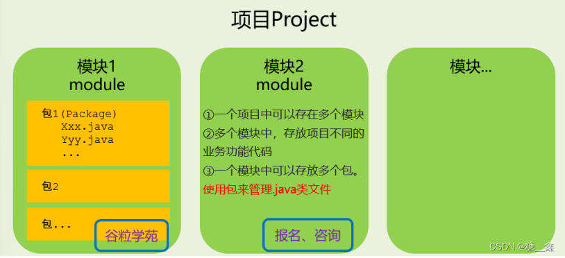

在 IntelliJ IDEA 中 Project 是最顶级的结构单元 ，然后就是Module。目前，主流的大型项目结构基本都是多 Module 的结构，这类项目一般是按功能划分的，比如：user-core-module、user-facade-module 和 userhessian-module 等等，模块之间彼此可以相互依赖 ，有着不可分割的业务关系。因此，对于 Project 来说：

当为单 Module 项目的时候，这个单独的 Module 实际上就是一个 Project。

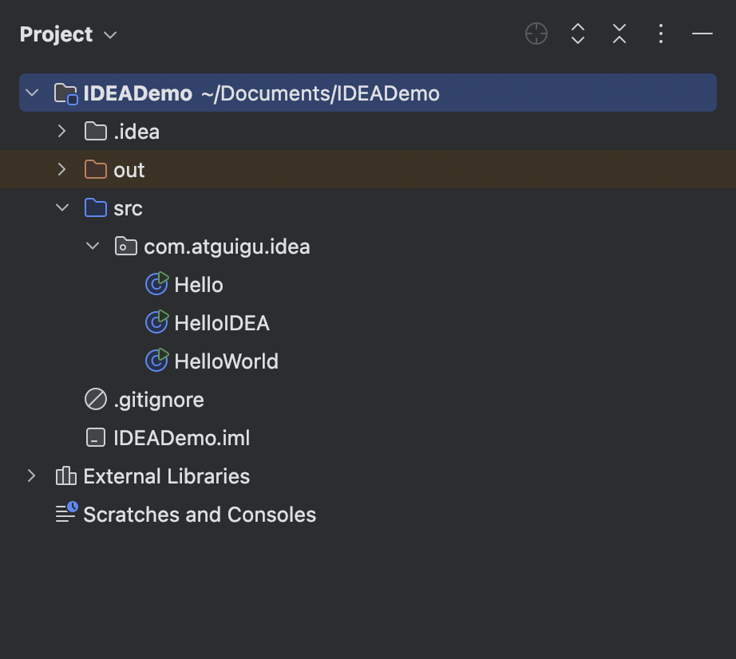

当为多 Module 项目的时候，多个模块处于同一个 Project 之中，此时彼此之间具有互相依赖的关联关系。

> **💡 当然多个模块没有建立依赖关系的话，也可以作为单独一个“小项目”运行。**

# 3. 创建Module
> 建议创建 “Empty空工程”，然后创建多模块，每一个模块可以独立运行，相当于一个小项目。JavaSE 阶段不涉及到模块之间的依赖。后期再学习模块之间的依赖。

## 3.1 步驟如下：
**① 选择创建模块**

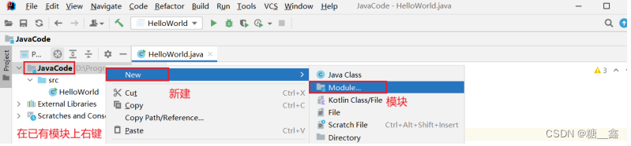

**② 选择模块类型：这里选择创建 Java 模块，给模块命名，确定存放位置**

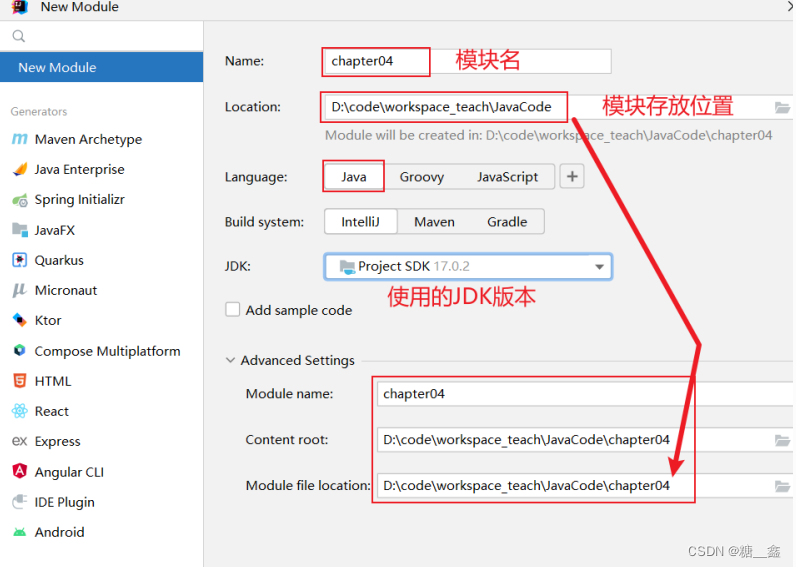

**③ 模块声明在工程下面：**

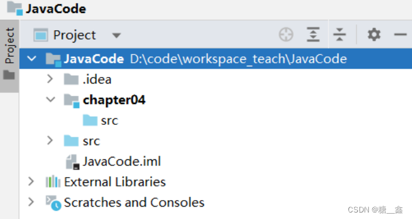

# 4. 删除模块

## 4.1 移除模块

> 使用 idea 打开需要删除的项目，在项目文件上右击选择 Remove Module 或者按 Delete 键

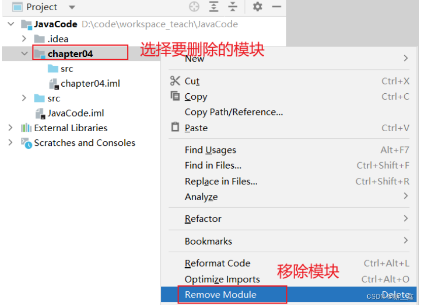

之后会弹出删除提示，“Remove Module 'xxx' from the project? No files will be deleted.”，意思是移除指定模块，但没有文件被删除，就是说，模块移除了，磁盘上的文件还在

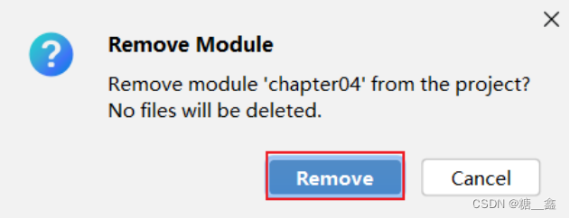

可以在文件上右击选择 Show in Explorer ，可以快速打开文件在磁盘的位置

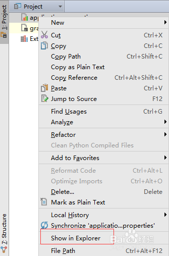

> ⚠️ **注意！**
> - mac 是點選 open in  ⇒  Finder
> - 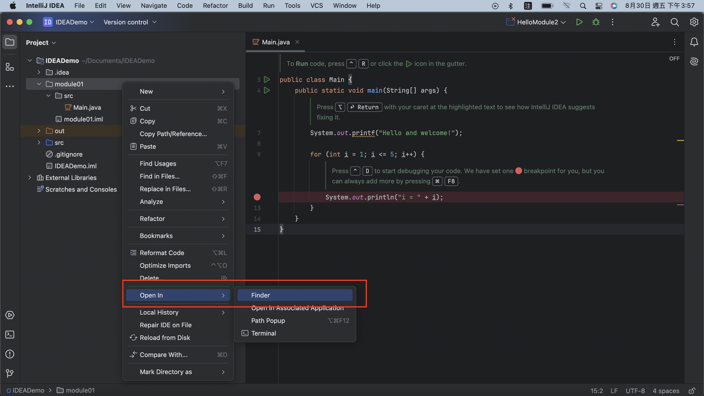

打开磁盘目录之后，可以看到模塊中的文件都在，一个也不少，idea 的删除是逻辑删除，磁盘上的文件需要自己手动删除

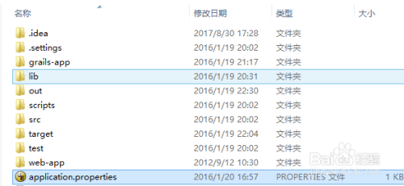

# 4.2 彻底删除模块

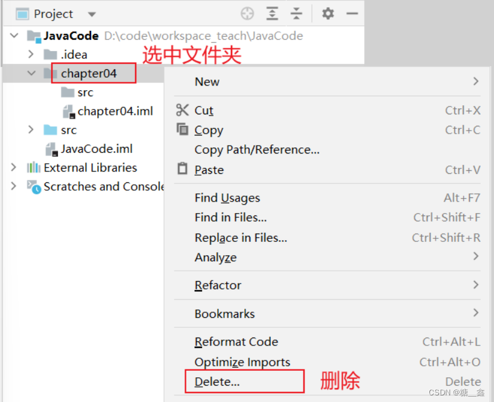

# 5. 导入模块

## 5.1 **( 1 ) 将老师的模块 `teacher_chapter04` 整个的复制到自己IDEA项目的路径下**

接着打开自己 IDEA 的项目，会在项目目录下看到拷贝过来的 module，只不过不是以模块的方式呈现。

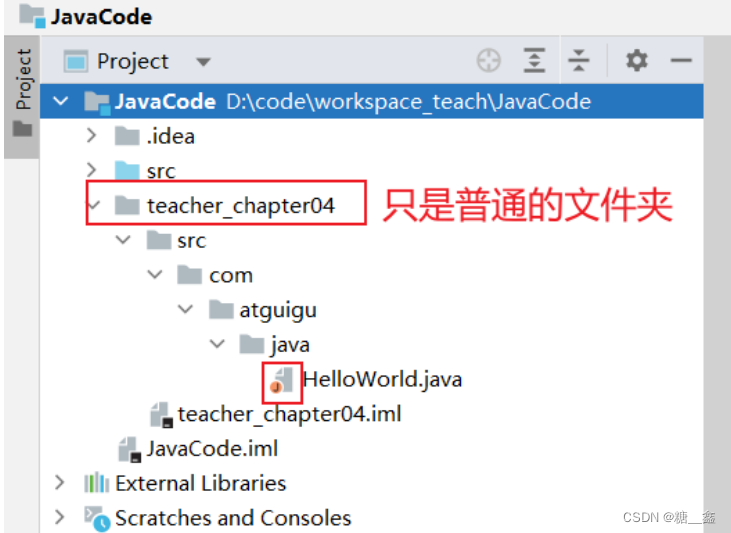

## 5.2 **( 2 ) 查看 Project Structure，选择 import module**:

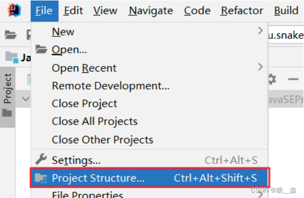

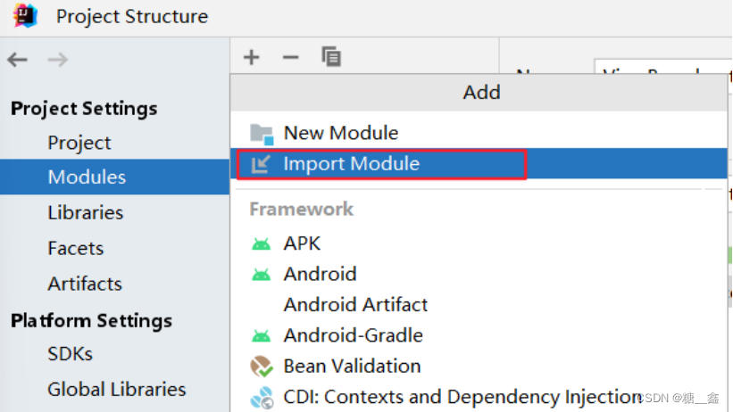

## 5.3 **( 3 ) 选择要导入的 module**

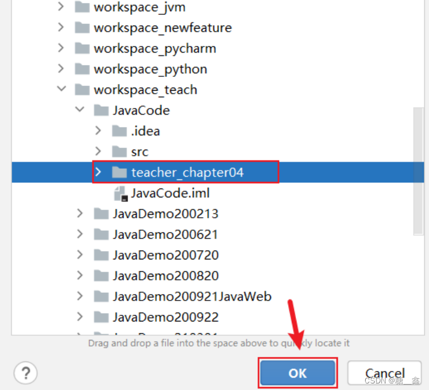

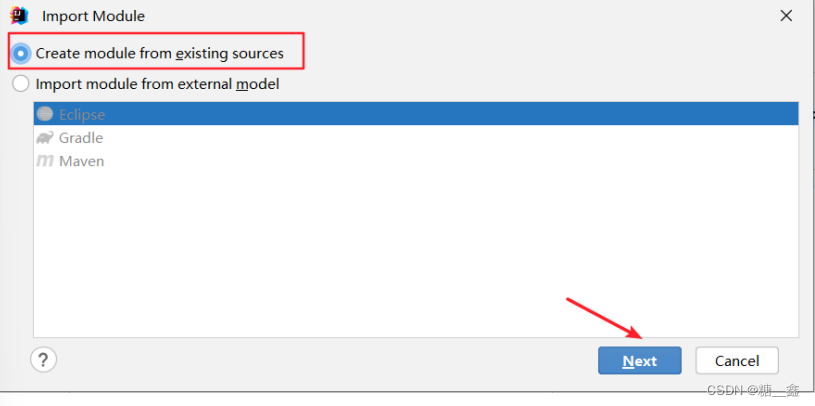

## 5.4 **( 4 ) 接着可以一路Next下去，最后选择Overwrite**

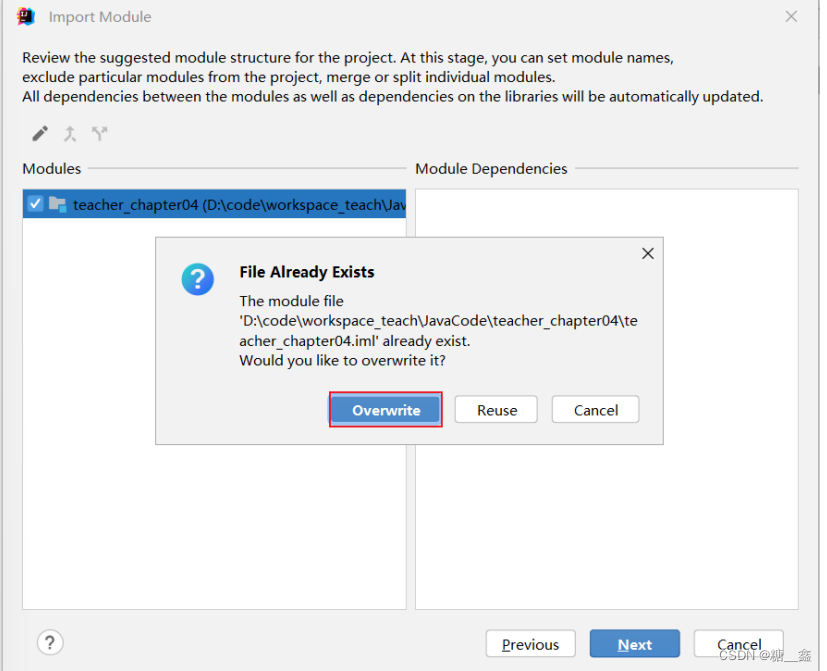

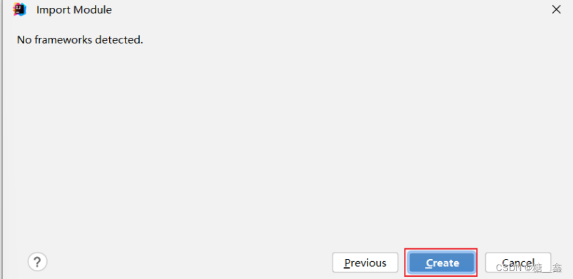

最后点击OK即可了。

# 6. 同时打开两个IDEA项目工程

## 6.1 **两个 IDEA 项目工程效果**

有些同学想要把上课练习代码和作业代码分开两个IDEA项目工程

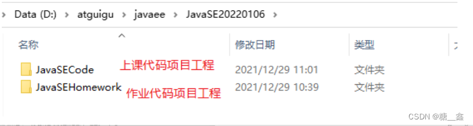

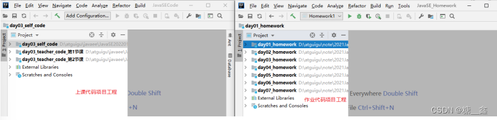

## 6.2 **新建一个IDEA项目**

> ⚠️ **注意**：第一次需要新建，之后直接打开项目工程即可。

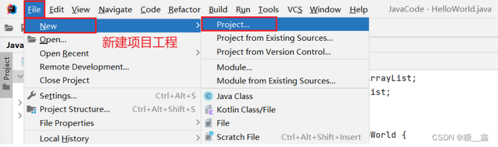

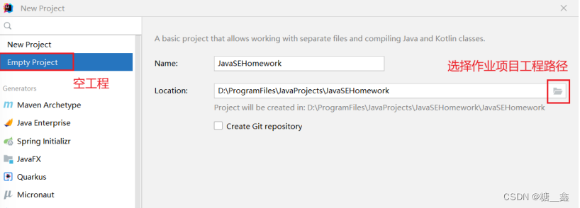

最后在点击Create

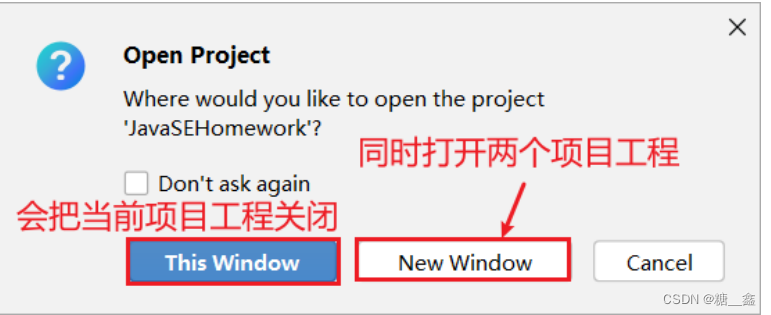

## 6.3 **打开两个IDEA项目**
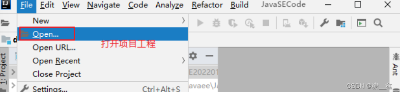

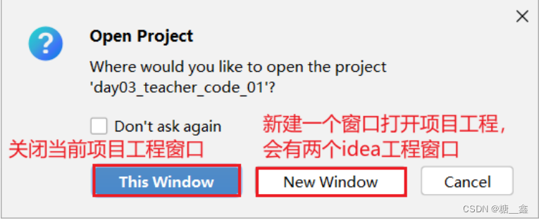

# 7. 导入前几章非IDEA工程代码

## ( 1 ) 创建chapter01、chapter02、chapter03等章节的module：

将相应章节的源文件粘贴到 module 的 src 下。

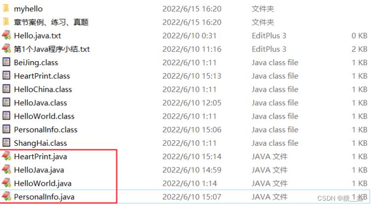

打开其中各个源文件，会发现有乱码。比如：

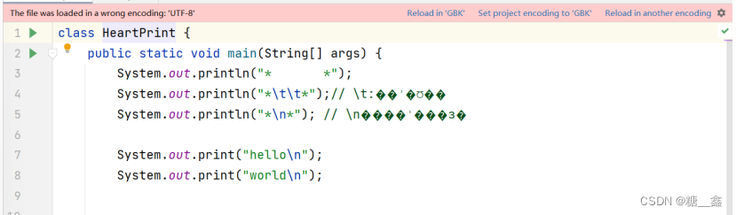

## **( 2 ) 设置编码**：

当前项目是 UTF-8。如果原来的 .java 文件都是 GBK 的（如果原来.java文件有的是GBK，有的是UTF-8就比较麻烦了）。我們可以单独把这两个模块设置为GBK编码的。

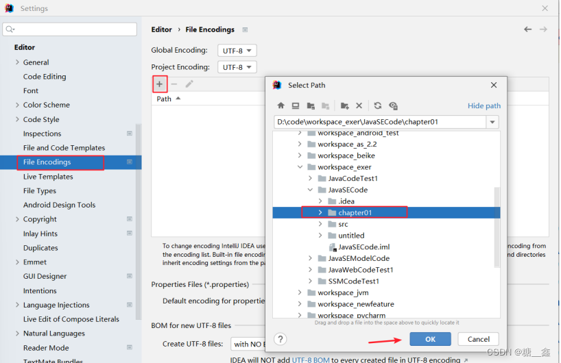

改为GBK，确认即可。如图：

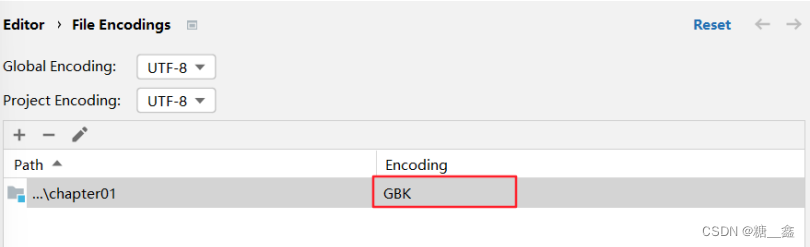