# 1. 查看Postfix Completion模板(后缀补全)

> **參考文章：**
> - [juejin.cn](https://juejin.cn/post/7270531609852526644)


> **后缀补全**是指在输入变量或代码串后，通过`.`等方式，按下tab/space/enter来快速生成代码的方式。例如我们非常常见的`"字符串".sout`就会生成代码`System.out.println("字符串");`。


# 2. 查看Live Templates模板(实时模板)
> **參考文章：**
> - [juejin.cn](https://juejin.cn/post/7270531609852526644)

> 动态模板即输入一段缩写，然后按下 enter 后会自动根据前后文生成对应的代码，主要用于方法、类、表达语句内。动态模板中的变量会根据定义，自动获取上下文中的类名、方法名等，从而自动生成代码。


### 优点
- 适合快速生成大段代码。
- 适合用在起始语句中，如 if、for、main 等。

### 缺点
- 不适合先写变量，之后再补全的情况。这种情况就十分适合后缀补全。

# 3. 常用代码模板
## 3.1 非空判断：

- 变量.null：if(变量 == null)
- 变量.nn：if(变量 != null)
- 变量.notnull：if(变量 != null)
- ifn：if(xx == null)
- inn：if(xx != null)

## 3.2 遍历数组和集合：

- 数组或集合变量.fori：for循环
- 数组或集合变量.for：增强for循环
- 数组或集合变量.forr：反向for循环
- 数组或集合变量.iter：增强for循环遍历数组或集合

## 3.3 输出语句：

- sout：相当于System.out.println
- soutm：打印当前方法的名称
- soutp：打印当前方法的形参及形参对应的实参值
- soutv：打印方法中声明的最近的变量的值
- 变量.sout：打印当前变量值
- 变量.soutv：打印当前变量名及变量值

## 3.4 对象操作

- 创建对象
    - Xxx.new .var ：创建Xxx类的对象，并赋给相应的变量
    - Xxx.new .field：会将方法内刚创建的Xxx对象抽取为一个属性
- 强转
    - 对象.cast：将对象进行强转
    - 对象.castvar：将对象强转后，并赋给一个变量

## 3.5 静态常量声明

- psf：public static final
- psfi：public static final int
- psfs：public static final String
- prsf：private static final

# 4. 自定义后缀补全模板

> 👉 **通过自定义，我们也可以拥有自己的后缀模板。**
> - 以下以 “输入`toMap`后补全代码为`.stream().collect(Collections.toMap());`” 为例，设置一个自定义的后缀补全。该例子能够让一个列表类型的变量转换为一个Map。

## 4.1 **第一步**

> 打开后缀补全设置（Editor | General | Postfix Completion），点击加号新增一个Java后缀补全。
> 

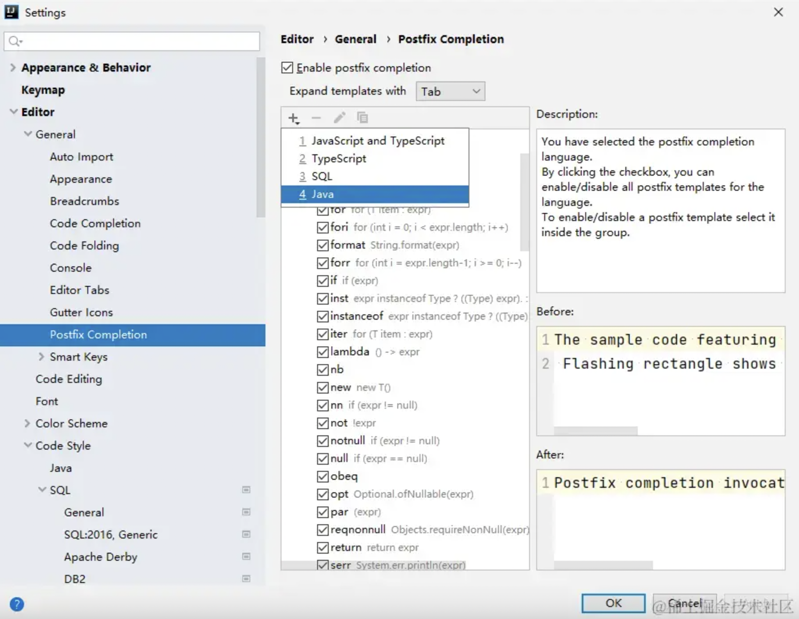

## 4.2 **第二步**

在key处设置后缀，支持语言最低版本具体选择。因为本例中Stream接口是Java 8才支持，故我们选择8版本。之后点击加号，设置要以哪种类型的变量作为后缀匹配的匹配变量。从上到下依次是：

- void
- 非void
- 布尔类型
- 数字类型
- 非基本类型（即除了基本类型包装类外的对象）
- 数组（不包括List、Set）
- 在项目中选取类
- 输入类名（**需要输入全类名**）
    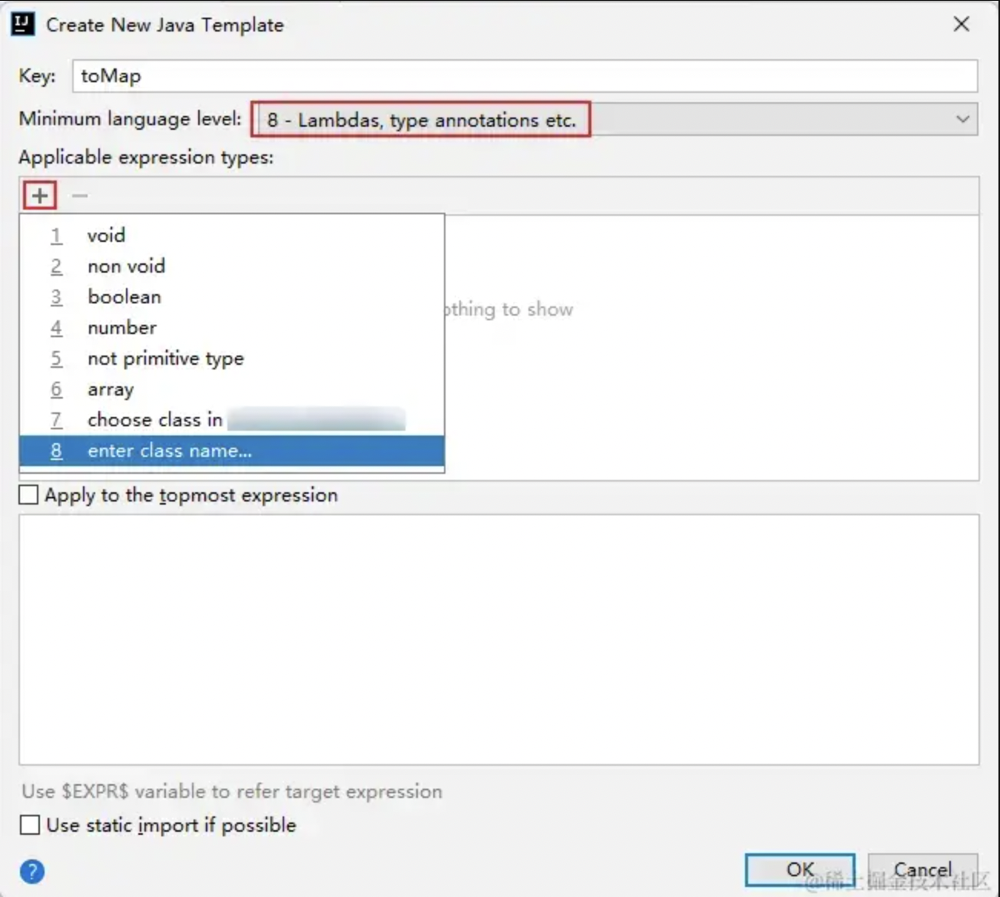
    
    因为是列表类型的变量才使用该后缀，故这里我们填写`java.util.Collection`。
    
    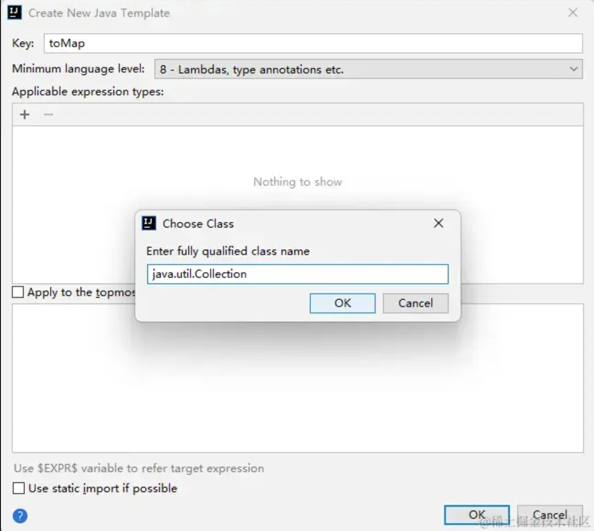

## 4.3 **第三步**

最后是输入展开后的表达式。使用`$EXPR$`来表示匹配的变量，使用`$END$`来表示光标结尾。

- 具体还有什么预定义变量，参见动态模板的文档：[www.jetbrains.com/help/idea/t…](https://link.juejin.cn/?target=https%3A%2F%2Fwww.jetbrains.com%2Fhelp%2Fidea%2Ftemplate-variables.html%23pdtv)

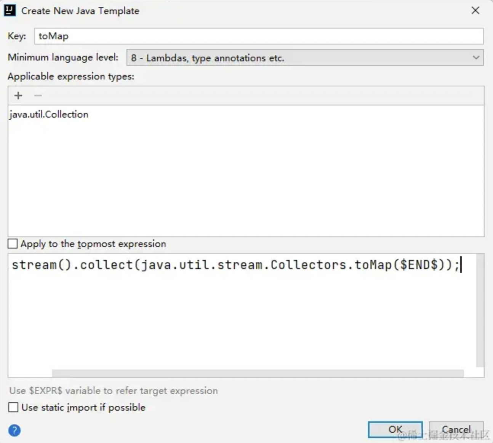

此处输入

```java
$EXPR$.stream().collect(java.util.Collections.toMap($END$));
```

> **注意**，这里使用的类名要使用全类名，否则之后还需要手动import类。
> 

## 4.4 **完成**

保存设置后，便可以使用该后缀补全功能：

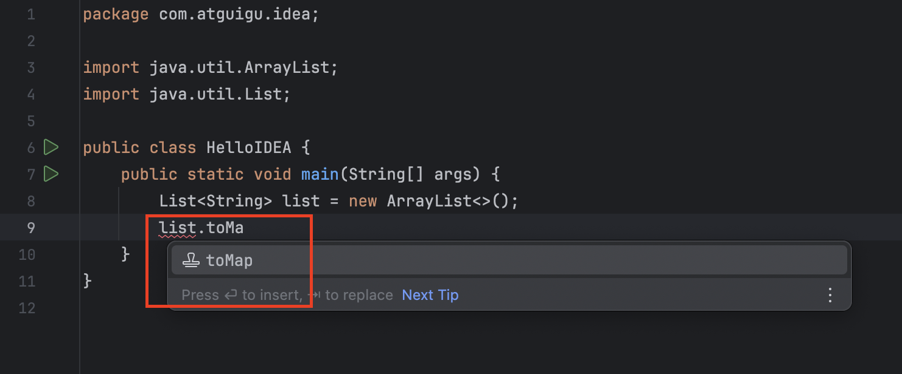

# 5. 自定义Live Templates
## 5.1 **定义 sop 代表 System.out.print(); 語句**

- ① 在Live Templates中增加模板
    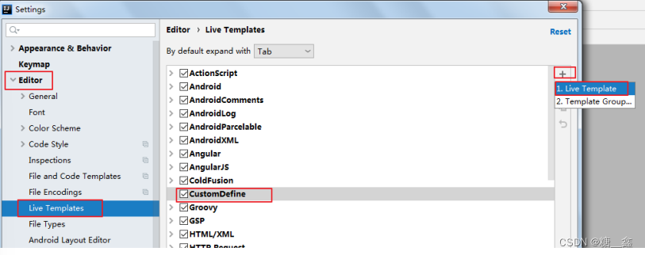

- ② 先定义一个模板的组，这样方便管理所有自定义的代码模板
    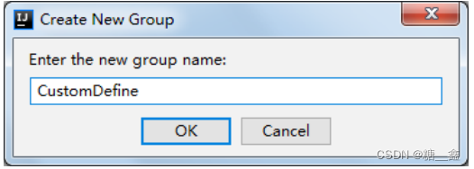
    
- ③ 在模板组里新建模板
    
    
- ④ 定义模板（以输出语句为例）
    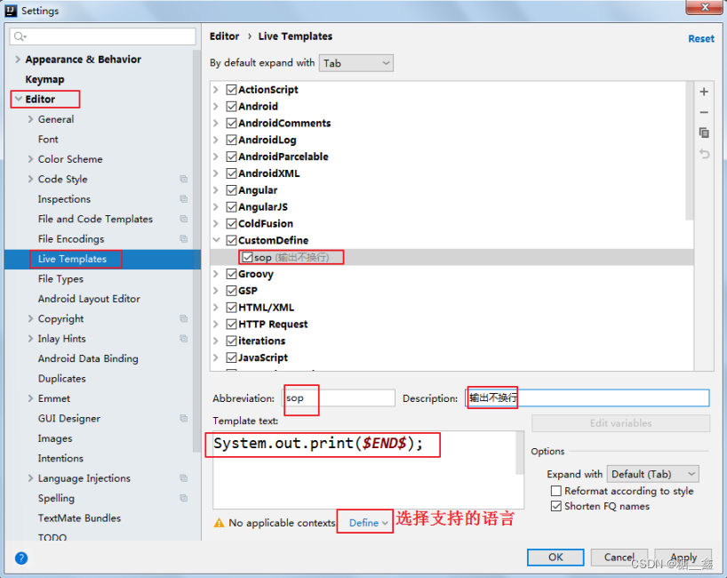
    
    - Abbreviation：模板的缩略名称
    - Description：模板的描述
    - Template text：模板的代码片段
    - 模板应用范围。比如点击Define。选择如下：应用在java代码中。
    
    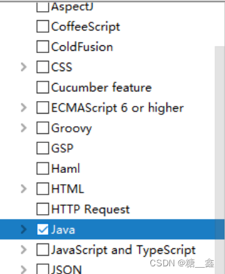

## 5.2 **其它模板1：单元测试模板**

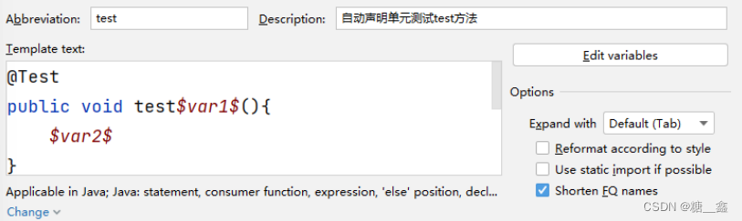

```java
@Test
public void test$var1$(){
	$var2$
}
```

## 5.3 **其它模板2：创建多线程**

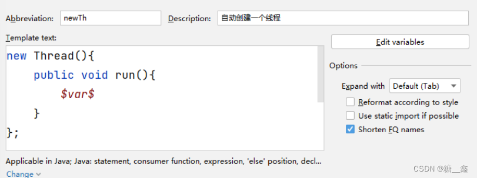

```java
new Thread(){
	public void run(){
		$var$
	}
};
```

## 5.4 **其它模板3：冒泡排序**

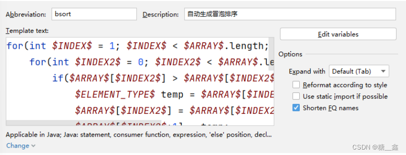

```java
for(int $INDEX$ = 1; $INDEX$ < $ARRAY$.length; $INDEX$++) {
	for(int $INDEX2$ = 0; $INDEX2$ < $ARRAY$.length-$INDEX$; $INDEX2$++) {
		if($ARRAY$[$INDEX2$] > $ARRAY$[$INDEX2$+1]){
			$ELEMENT_TYPE$ temp = $ARRAY$[$INDEX2$];
			$ARRAY$[$INDEX2$] = $ARRAY$[$INDEX2$+1];
			$ARRAY$[$INDEX2$+1] = temp;
		}
	}
}
```