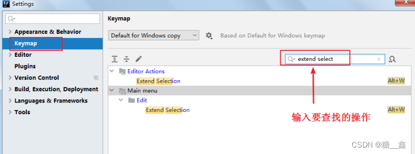
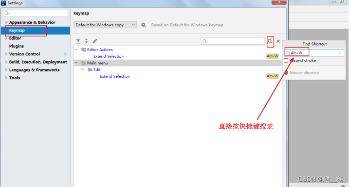
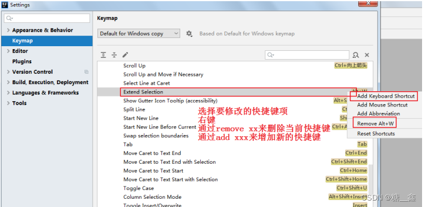
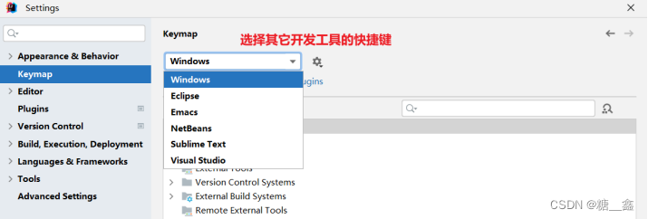

# 1. 常用快捷键

## 1.1 第1组：通用型

| 快捷鍵 | 說明 |
| --- | --- |
| ctrl + c | 复制代码-copy |
| ctrl + v | 粘贴-paste |
| ctrl + x | 剪切-cut |
| ctrl + z | 撤销-undo |
| ctrl + shift + z | 反撤销-redo |
| ctrl + s | 保存-save all |
| ctrl + a | 全选-select all |

## 1.2 第2组：提高编写速度（上）

| 快捷鍵 | 說明 |
| --- | --- |
| alt + enter | 智能提示-edit |
| ctrl+j | 提示代码模板-insert live template |
| ctrl+alt+t | 使用xx块环绕-surround with … |
| alt+insert | 调出生成getter/setter/构造器等结构-generate … |
| ctrl+alt+v	 | 自动生成返回值变量-introduce variable … |
| ctrl+d | 复制指定行的代码-duplicate line or selection |
| ctrl+y | 删除指定行的代码-delete line |
| shift + enter | 切换到下一行代码空位-start new line |
| ctrl +alt+ enter | 切换到上一行代码空位-start new line before current |
| ctrl+shift+↑ | 向上移动代码-move statement up |
| ctrl+shift+↓ | 向下移动代码-move statement down |
| alt+shift+↑ | 向上移动一行-move line up |
| alt+shift+↓ | 向下移动一行-move line down |
| ctrl+p | 方法的形参列表提醒-parameter info |

## 1.3 第3组：提高编写速度（下）

| 快捷鍵 | 說明 |
| --- | --- |
| shift+f6 | 批量修改指定的变量名、方法名、类名等-rename |
| ctrl+alt+m | 抽取代码重构方法-extract method … |
| ctrl+o | 重写父类的方法-override methods … |
| ctrl+i | 实现接口的方法-implements methods … |
| ctrl+shift+u | 选中的结构的大小写的切换-toggle case |
| ctrl+alt+o | 批量导包-optimize imports |

## 1.4 第4组：类结构、查找和查看源码

| 快捷鍵 | 說明 |
| --- | --- |
| ctrl + 选中指定的结构 或 ctrl+n | 如何查看源码-go to class… |
| ctrl+f12 | 显示当前类结构，支持搜索指定的方法、属性等-file structure |
| ctrl+alt+← | 退回到前一个编辑的页面-back |
| ctrl+alt+→ | 进入到下一个编辑的页面-forward |
| alt+←/→ | 打开的类文件之间切换-select previous/next tab |
| ctrl+h | 光标选中指定的类，查看继承树结构-Type Hierarchy |
| ctrl+q | 查看方法文档-quick documentation |
| ctrl+alt+u | 类的UML关系图-show uml popup |
| ctrl+g | 定位某行-go to line/column |
| ctrl+alt+b | 回溯变量或方法的来源-go to implementation(s) |
| ctrl+shift+ - | 折叠方法实现-collapse all |
| ctrl+shift+ +	 | 展开方法实现-expand all |

## 1.5 第5组：查找、替换与关闭

| 快捷鍵 | 說明 |
| --- | --- |
| ctlr+f	 | 查找指定的结构 |
| ctrl+l	 | 快速查找：选中的Word快速定位到下一个-find next |
| ctrl+r	 | 查找与替换-replace |
| home	 | 直接定位到当前行的首位-move caret to line start |
| end	 | 直接定位到当前行的末位 -move caret to line end |
| ctrl+f7	 | 查询当前元素在当前文件中的引用，然后按 F3 可以选择 |
| ctrl+shift+f	 | 全项目搜索文本-find in path … |
| ctrl+f4	 | 关闭当前窗口-close |

## 1.6 第6组：调整格式

| 快捷鍵 | 說明 |
| --- | --- |
| ctrl+alt+l	 | 格式化代码-reformat code |
| ctrl + /	 | 使用单行注释-comment with line comment |
| ctrl + shift + /	 | 使用/取消多行注释-comment with block comment |
| tab	 | 选中数行，整体往后移动-tab |
| shift + tab	 | 选中数行，整体往前移动-prev tab |

## 1.7 Debug快捷键

| 快捷鍵 | 說明 |
| --- | --- |
| F8	 | 单步调试（不进入函数内部）- step over |
| F7	 | 单步调试（进入函数内部）- step into |
| alt+shift+f7	 | 强制单步调试（进入函数内部） - force step into |
| shift + F7	 | 选择要进入的函数 - smart step into |
| shift + F8	 | 跳出函数 - step out |
| alt + F9	 | 运行到断点 - run to cursor |
| F9	 | 继续执行，进入下一个断点或执行完程序 - resume program |
| Ctrl+F2	 | 停止 - stop |
| Ctrl+Shift+F8	 | 查看断点 - view breakpoints |
| Ctrl+F4	 | 关闭 - close |

# 2. 查看快捷键

## 2.1 **已知快捷键操作名，未知快捷键**

## 2.2 **已知快捷键，不知道对应的操作名**

# 3. 自定义快捷键

# 4. 使用其它平台快捷键

> ⚠️ **注意**：
> - 苹果电脑或者是用惯Eclipse快捷的，可以选择其他快捷键插件。

