# 1. 为什么需要Debug?

> 编好的程序在执行过程中如果出现错误，该如何查找或定位错误呢？简单的代码直接就可以看出来，但如果代码比较复杂，就需要借助程序调试来查找错误了。
> 

```java
运行编写好的程序时，可能出现的几种情况：
> 情况1：没有任何bug,程序执行正确！
====================如果出现如下的三种情况，都又必要使用debug=============================
> 情况2：运行以后，出现了错误或异常信息。但是通过日志文件或控制台，显示了异常信息的位置。
> 情况3：运行以后，得到了结果，但是结果不是我们想要的。
> 情况4：运行以后，得到了结果，结果大概率是我们想要的。但是多次运行的话，可能会出现不是我们想要的情况。
比如：多线程情况下，处理线程安全问题。
```

# 2. Debug的步骤

> **Debug(调试)程序步骤如下**
> 1. 添加断点
> 2. 启动调试
> 3. 单步执行
> 4. 观察变量和执行流程，找到并解决问题

## 2.1 **添加断点**

> 在源代码文件中，在想要设置断点的代码行的前面的标记行处，单击鼠标左键就可以设置断点，在相同位置再次单击即可取消断点。

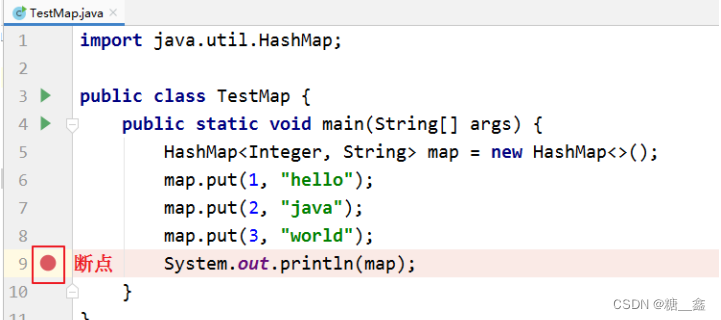

> ⚠️ **说明：在Debug过程中，可以动态的下断点。**

## 2.2 **启动调试**

> IDEA 提供多种方式来启动程序(Launch)的调试，分别是通过菜单(Run –> Debug)、图标(“绿色臭虫”) 等等。

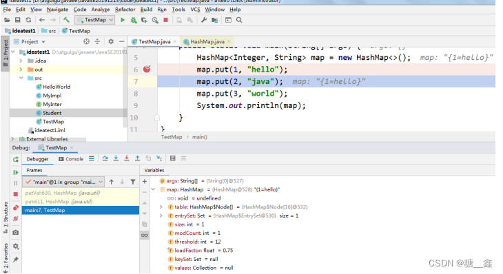

## 2.3 **单步调试工具介绍**

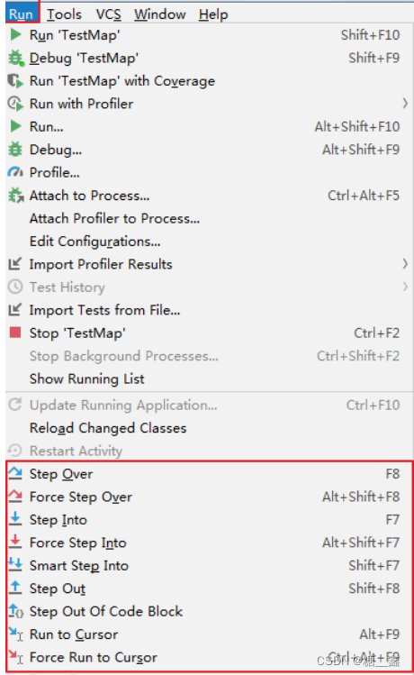

**或**

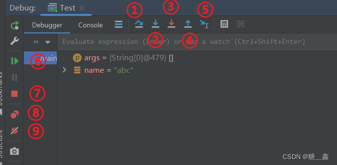

- ① Step Over（F8）：进入下一步，如果当前行断点是调用一个方法，则不进入当前方法体内
- ② Step Into（F7）：进入下一步，如果当前行断点是调用一个自定义方法，则进入该方法体内
- ③ Force Step Into（Alt +Shift + F7）：进入下一步，如果当前行断点是调用一个核心类库方法，则进入该方法体内
- ④ Step Out（Shift + F8）：跳出当前方法体
- ⑤ Run to Cursor（Alt + F9）：直接跳到光标处继续调试
- ⑥ Resume Program（F9）：恢复程序运行，但如果该断点下面代码还有断点则停在下一个断点上
- ⑦ Stop（Ctrl + F2）：结束调试
- ⑧ View Breakpoints（Ctrl + Shift + F8）：查看所有断点
- ⑨ Mute Breakpoints：使得当前代码后面所有的断点失效， 一下执行到底

# 3. 多种Debug情况介绍

## 3.1 **行断点**

> 断点打在代码所在的行上。执行到此行时，会停下来。
> 

```java
package com.atguigu.debug;

/**
* ClassName: Debug01
* Package: com.atguigu.debug
* Description: 演示1：行断点 & 测试debug各个常见操作按钮
*
* @Author: 尚硅谷-宋红康
* @Create: 2022/10/20 18:44
* @Version 1.0
*/
public class Debug01 {
	public static void main(String[] args) {
		//1.
		int m = 10;
		int n = 20;
		System.out.println("m = " + m + ",n = " + n);
		swap(m, n);
		System.out.println("m = " + m + ",n = " + n);
		
		//2.
		int[] arr = new int[] {1,2,3,4,5};
		System.out.println(arr);//地址值
		char[] arr1 = new char[] {'a','b','c'};
		System.out.println(arr1);//abc
	 }
	public static void swap(int m,int n){
		int temp = m;
		m = n;
		n = temp;
	}
}
```

## 3.2 **方法断点**

- 断点设置在方法的签名上，默认当进入时，断点可以被唤醒。
- 也可以设置在方法退出时，断点也被唤醒
    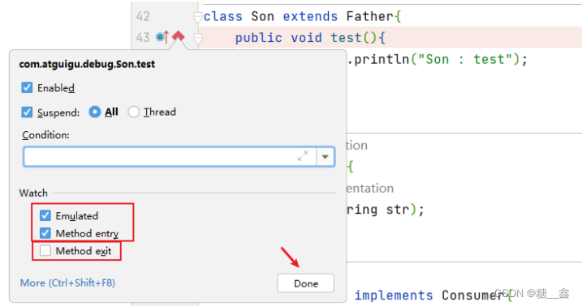
    
- 在多态的场景下，在父类或接口的方法上打断点，会自动调入到子类或实现类的方法。
    
    ```java
    package com.atguigu.debug;
    
    import java.util.HashMap;
    /**
    * ClassName: Debug02
    * Package: com.atguigu.debug
    * Description: 演示2： 方法断点
    *
    * @Author: 尚硅谷-宋红康
    * @Create: 2022/10/20 21:15
    * @Version 1.0
    */
    
    public class Debug02 {
    	public static void main(String[] args) {
    		//1.
    		Son instance = new Son();
    		instance.test();
    		
    		//2.
    		Father instance1 = new Son();
    		instance1.test();
    		
    		//3.
    		Consumer con = new ConsumerImpl();
    		con.accept("atguigu");
    		
    		//4.
    		HashMap map = new HashMap();
    		map.put("Tom",12);
    		map.put("Jerry",11);
    		map.put("Tony",20);
    		}
    	}
    	class Father{
    		public void test(){
    			System.out.println("Father : test");
    		}
    	}
    	
    class Son extends Father{
    	public void test(){
    		System.out.println("Son : test");
    	}
    }
    
    interface Consumer{
    	void accept(String str);
    }
    
    class ConsumerImpl implements Consumer{
    	@Override
    	public void accept(String str) {
    		System.out.println("ConsumerImple:" + str);
    	}
    }
    ```
    

## 3.3 **字段断点**

- 在类的属性声明上打断点，默认对属性的修改操作进行监控
    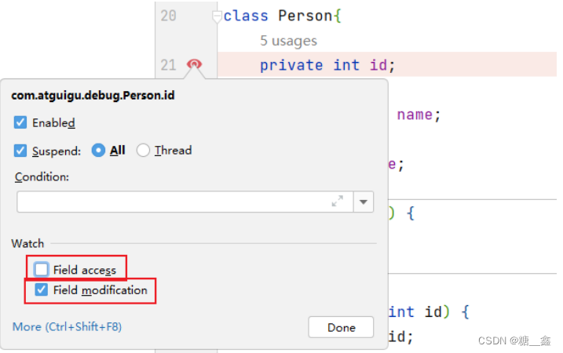
    

```java
package com.atguigu.debug;
/**
* ClassName: Debug03
* Package: com.atguigu.debug
* Description: 演示3：字段断点
*
* @Author: 尚硅谷-宋红康
* @Create: 2022/10/20 21:34
* @Version 1.0
*/
public class Debug03 {
	public static void main(String[] args) {
		Person p1 = new Person(3);
		System.out.println(p1);
	}
}
class Person{
	private int id = 1;
	private String name;
	private int age;
	
	public Person() {
	}
	
	{
		id = 2;
	}
	
	public Person(int id) {
		this.id = id;
	}

public Person(int id, String name, int age) {
	this.id = id;
	this.name = name;
	this.age = age;
}
public int getId() {
	return id;
}

public void setId(int id) {
	this.id = id;
}

public String getName() {
	return name;
}

public void setName(String name) {
	this.name = name;
}

public int getAge() {
	return age;
}

public void setAge(int age) {
	this.age = age;
}
@Override
public String toString() {
	return "Person{" +"id=" + id +", name='" + name + '\'' +", age=" + age +'}';
  }
}

```

## 3.4 **条件断点**

> **针对下述代码，在满足 `arr[i] % 3 == 0` 的条件下，执行断点。**
> - 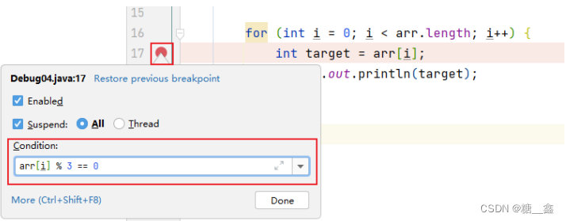

```java
package com.atguigu.debug;
/**
* ClassName: Debug04
* Package: com.atguigu.debug
* Description: 演示4：条件断点
*
* @Author: 尚硅谷-宋红康
* @Create: 2022/10/20 21:49
* @Version 1.0
*/
public class Debug04 {
	public static void main(String[] args) {
		int[] arr = new int[]{1,2,3,4,5,6,7,8,9,10,11,12};
		for (int i = 0; i < arr.length; i++) {
			int target = arr[i];
			System.out.println(target);
		}
	}
}
```

## 3.5 **异常断点**

> 对异常进行跟踪。如果程序出现指定异常，程序就会执行断点，自动停住。
> 

通过下图的方式，对指定的异常进行监控

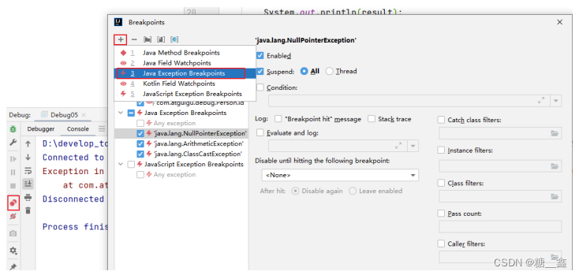

```java
package com.atguigu.debug;
import java.util.Date;
	/**
	* ClassName: Debug05
	* Package: com.atguigu.debug
	* Description: 演示5：异常断点
	*
	* @Author: 尚硅谷-宋红康
	* @Create: 2022/10/20 22:01
	* @Version 1.0
	*/
public class Debug05 {
	public static void main(String[] args) {
		int m = 10;
		int n = 0;
		int result = m / n;
		System.out.println(result);
		// Person p1 = new Person(1001);
		// System.out.println(p1.getName().toUpperCase());
	}
}

```

## 3.5 **线程调试**

通过下图的方式，对指定的線程进行监控  ⇒  `Thread.*currentThread*().getName().equals("Thread2")`

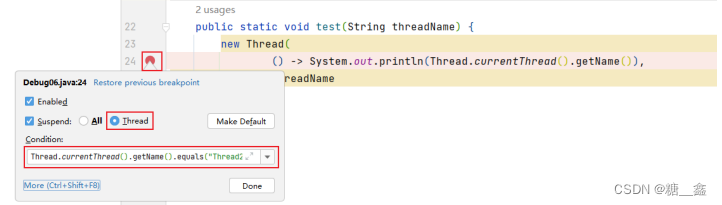

```java
package com.atguigu.debug;
/**
* ClassName: Debug06
* Package: com.atguigu.debug
* Description: 演示6：线程调试
*
* @Author: 尚硅谷-宋红康
* @Create: 2022/10/20 22:46
* @Version 1.0
*/
public class Debug06 {
	public static void main(String[] args) {
		test("Thread1");
		test("Thread2");
}
public static void test(String threadName) {
	new Thread(
	() -> System.out.println(Thread.currentThread().getName()),threadName).start();  //java8新特性Lambda表达式
    }
}
```

## 3.7 **强制结束**

> **斷點要下在調用方法的處，即如右該行代碼  ⇒  `insert();`**
> - 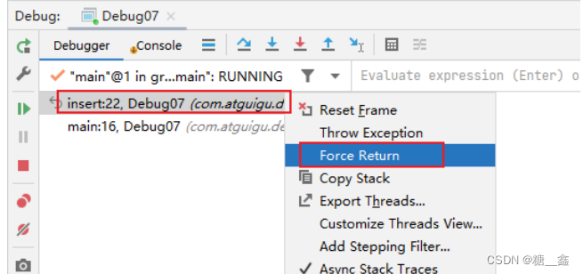


```java
package com.atguigu.debug;
/**
* ClassName: Debug07
* Package: com.atguigu.debug
* Description: 演示7：强制结束
*
* @Author: 尚硅谷-宋红康
* @Create: 2022/10/20 23:15
* @Version 1.0
*/
public class Debug07 {
	public static void main(String[] args) {
		System.out.println("获取请求的数据");
		System.out.println("调用写入数据库的方法");
		insert();
		System.out.println("程序结束");
	}
	private static void insert() {
		System.out.println("进入insert()方法");
		System.out.println("获取数据库连接");
		System.out.println("将数据写入数据表中");
		System.out.println("写出操作完成");
		System.out.println("断开连接");
	}
}

```

# 4. 自定义调试数据视图

> **设置如下**
> - 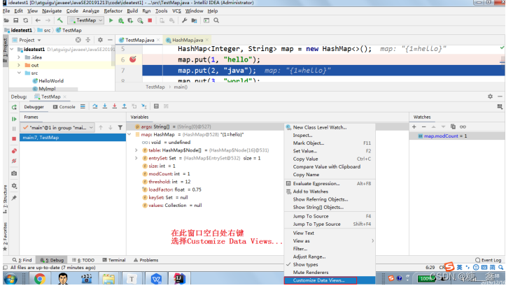
> - 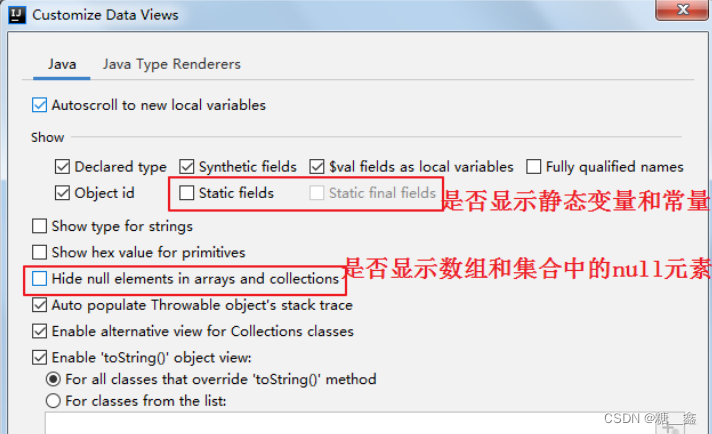

```java
package com.atguigu.debug;
import java.util.HashMap;
/**
* ClassName: Debug08
* Package: com.atguigu.debug
* Description: 演示8：用户自定义数据视图
*
* @Author: 尚硅谷-宋红康
* @Create: 2022/10/20 23:21
* @Version 1.0
*/
public class Debug08 {
	public static void main(String[] args) {
		HashMap<Integer,String> map = new HashMap<>();
		map.put(1,"高铁");
		map.put(2,"网购");
		map.put(3,"支付宝");
		map.put(4,"共享单车");
		System.out.println(map);
	}
}
```

# 5. 常见问题

## 5.1 **问题：使用 Step Into 时，会出现无法进入源码的情况。如何解决 ？**

### 方案1：
> 使用 force step into 即可

### 方案2：
> 点击 Setting  ⇒  Build,Execution,Deployment  ⇒  Debugger  ⇒  Stepping 把 Do not step into the classess 中的 java.* 、 javax.* 取消勾选即可。

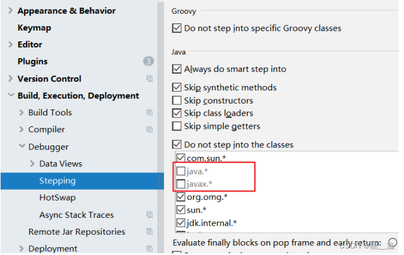