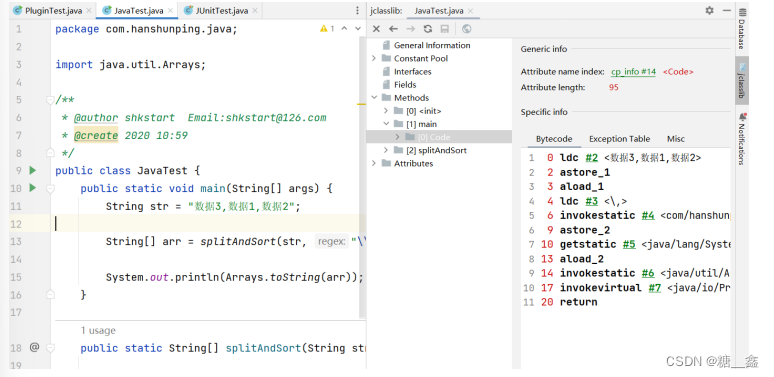
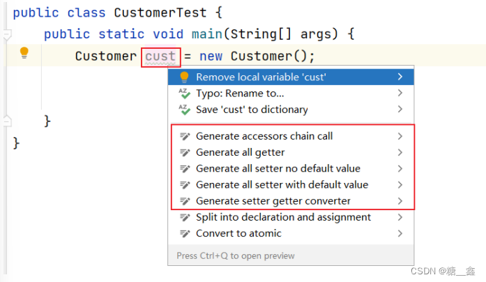
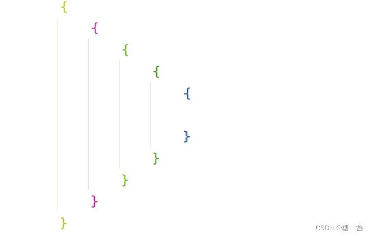
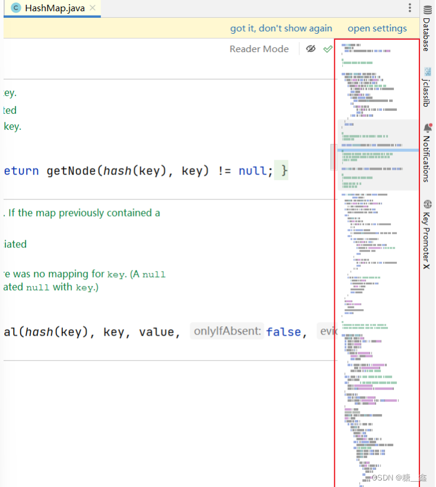
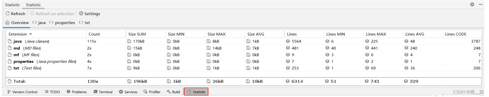
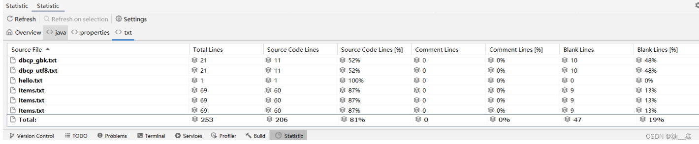
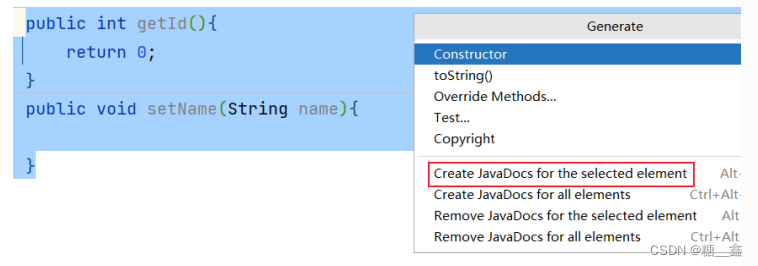
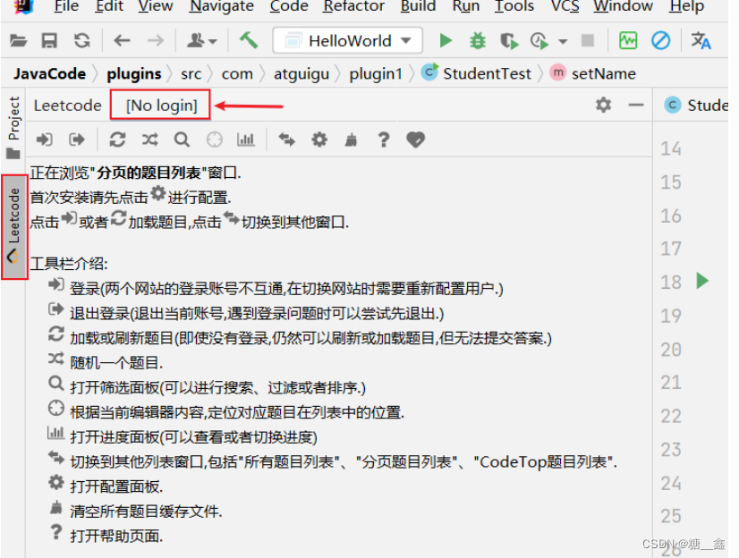
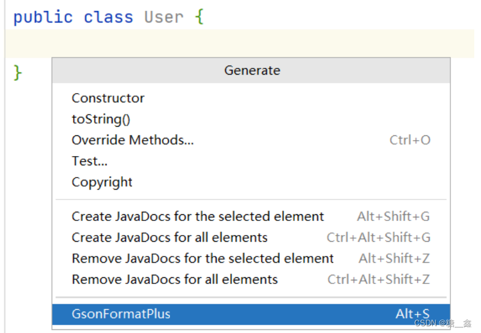

# 1. 在線安裝

> **參考文章：**
> - [IDEA 插件怎么安装？（图文讲解） - 犬小哈教程](https://www.quanxiaoha.com/idea/idea-install-plugin.html#安装步骤)


## 1.1 **安装步骤**

> ⚠️ **注意: 插件安装成功后，需重启 IDEA, 才能让插件生效**。

根据你的系统依次点击菜单：

- Windows 系统：*File -> Settings... -> Plugins*;
- Mac 系统：*IntelliJ IDEA -> Preferences -> Plugins*;

点击 `Marketplace` 插件市场, 输入想要安装的插件关键词， 这里以 *One Dark theme* 这款主题插件作为演示:


等待插件安装完成：


安装成功后，可在 `Installed` 列表中查看已安装成功的插件：


# 2. IDEA常用插件

## 2.1 **Alibaba Java Coding Guidelines**


- 阿里巴巴Java编码规范检查插件，检测代码是否存在问题，以及是否符合规范。
- 使用：在类中，右键，选择编码规约扫描，在下方显示扫描规约和提示。根据提示规范代码，提高代码质量。

## 2.2 **jclasslib bytecode viewer**

> **可视化的字节码查看器的使用：**
> 
> 1. 在 IDEA 打开想研究的类。
> 2. 编译该类或者直接编译整个项目（ 如果想研究的类在 jar 包中，此步可略过）。
> 3. 打开“view” 菜单，选择“Show Bytecode With jclasslib” 选项。
> 4. 选择上述菜单项后 IDEA 中会弹出 jclasslib 工具窗口。



> 💡 **英文设置：在 Help  ⇒  Edit Custom VM Options …，加上 `Duser.language=en`。**

## 2.3 **Translation**


- 注册翻译服务（有道智云、百度翻译开放平台、阿里云机器翻译）帐号，开通翻译服务并获取其应用ID和密钥 绑定应用ID和密钥：偏好设置（设置） > 工具 > 翻译 > 常规 > 翻译引擎 > 配置…
- 使用：鼠标选中文本，点击右键即可自动翻译成多国语言。
- 注：请注意保管好你的应用密钥，防止其泄露。

## 2.4 **GenerateAllSetter**


> 实际开发中还有一个非常常见的场景： 我们创建一个对象后，想依次调用 Setter 函数对属性赋值，如果属性较多很容易遗漏或者重复。



> 可以使用这 GenerateAllSetter 提供的功能，快速生成对象的所有 Setter 函数（可填充默认值），然后自己再跟进实际需求设置属性值。

## 2.5 **Rainbow Brackets**


> 给括号添加彩虹色，使开发者通过颜色区分括号嵌套层级，便于阅读



## 2.6 **CodeGlance Pro**


> **在编辑器右侧生成代码小地图，可以拖拽小地图光标快速定位代码，阅读行数很多的代码文件时非常实用。**
> - 

## 2.7 **Statistic**


代码统计工具。





## 2.8 **Presentation Assistant**


## 2.9 **Key Promoter X**

> 快捷键提示插件。当你执行鼠标操作时，如果该操作可被快捷键代替，会给出提示，帮助你自然形成使用快捷键的习惯，告别死记硬背。
> 


## 2.10 **JavaDoc**


按 `alt+insert` ，执行操作：



## 2.11 **LeetCode Editor**

> 在 IDEA 里刷力扣算法题




## 2.12 **GsonFormatPlus**


- 根据 json 生成对象。
- 使用：使用alt + s 或 alt + insert调取。
	
    
- 舉例：
    
    ```java
    {
    	"name": "tom",
    	"age": "18",
    	"gender": "man",
    	"hometown": {
    		"province": "河北省",
    		"city": "石家庄市",
    		"county": "正定县"
    	}
    }
    ```
    

## 2.13 **Material Theme UI**


- 对于很多人而言，写代码时略显枯燥的，如果能够安装自己喜欢的主题将为开发工作带来些许乐趣。
- IDEA 支持各种主题插件，其中最出名的当属 Material Theme UI。
- 安装后，可以从该插件内置的各种风格个选择自己最喜欢的一种。

