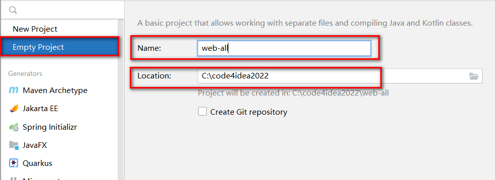
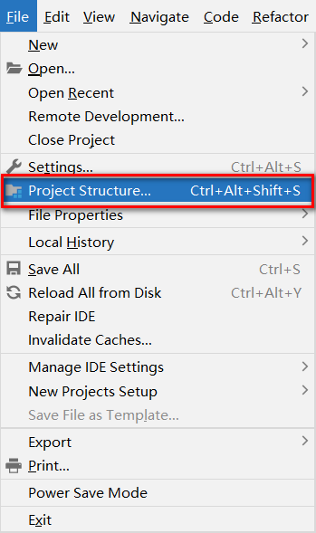
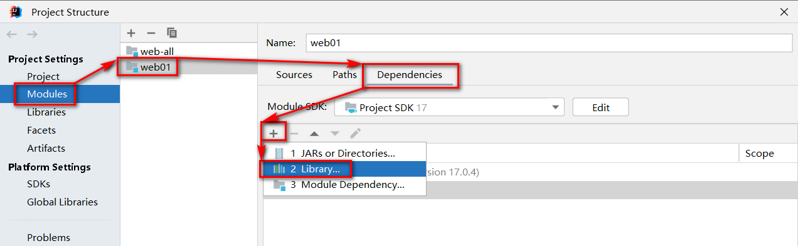
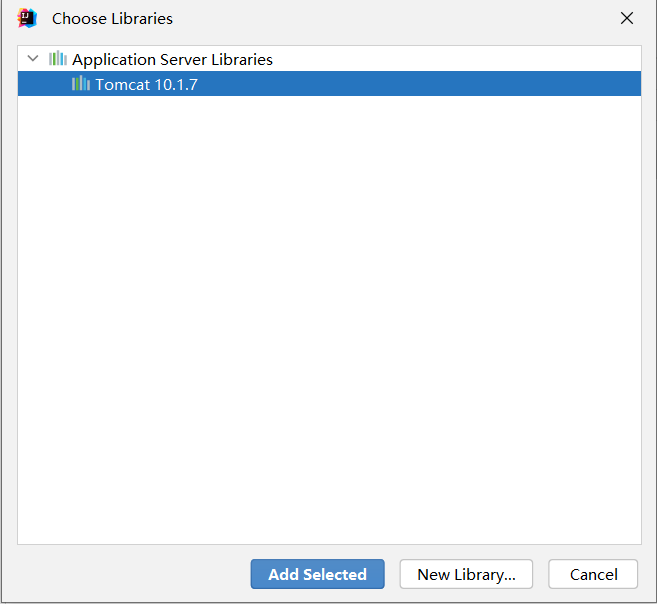
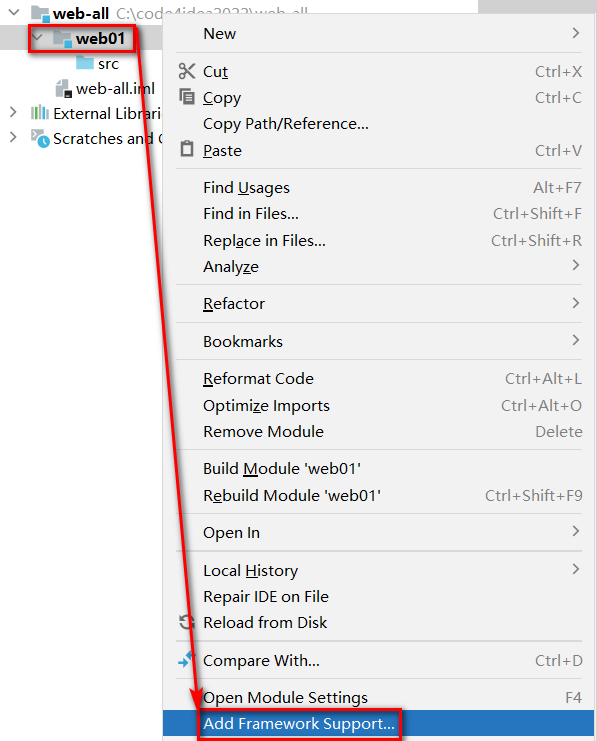
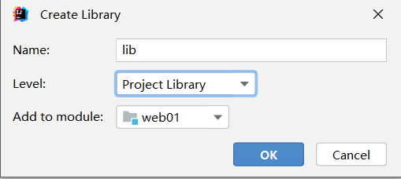
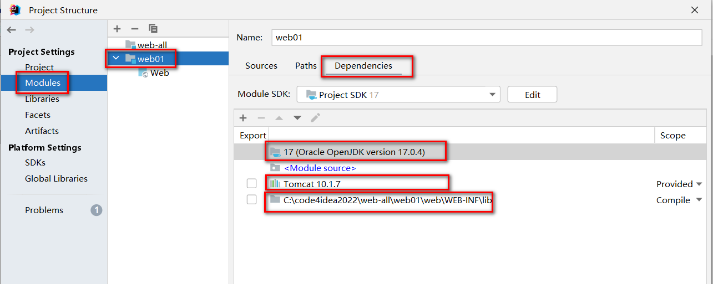

> 推荐先创建一个空项目，这样可以在一个空项目下同时存在多个 modules，不用后续来回切换之前的项目，当然也可以忽略此步直接创建 `web` 项目

> 检查项目的 SDK、语法版本、以及项目编译后的输出目录

> 先创建一个普通的 JAVA 项目

> 检查各项信息是否填写有误

> 创建完毕后，为项目添加 Tomcat 依赖

> 选择 modules，添加 framework support（如果找不到使用记得全局搜索（快捷键 `ShiftShift`）（记得先选中模块））

> 选择 Web Application 注意 Version 为 5.0（如果上面没有为项目添加 Tomcat10 依赖的话是选不了的（新版已经是6.0了）），勾选  Create web.xml

> 删除 index.jsp，替换为 index.html

### 处理配置文件

+ 在工程下创建 `resources` 目录，专门用于存放配置文件(都放在`src`下也行，单独存放可以尽量避免文件集中存放造成的混乱)
+ 标记目录为资源目录，不标记的话则该目录不参与编译

+ 标记完成后,显示效果如下

### 处理依赖jar包问题
+ 在 `WEB-INF` 下创建 `lib`目录
+ 必须在 `WEB-INF` 下，且目录名必须叫 `lib` !!!
+ 复制 jar文件进入 `lib` 目录

+ 将lib目录添加为当前项目的依赖，后续可以用maven统一解决

+ 环境级别推荐选择module 级别，降低对其他项目的影响，name可以空着不写

### 查看当前项目有那些环境依赖

+ 在此位置，可以通过-号解除依赖

