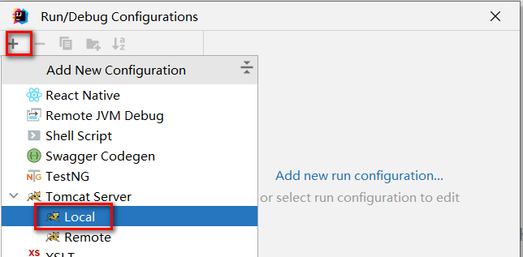
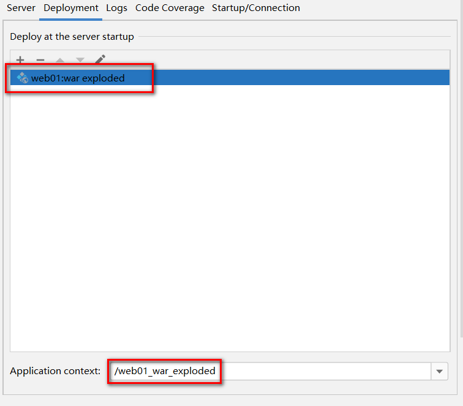
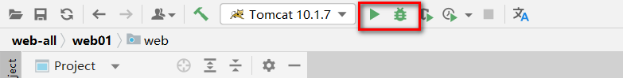
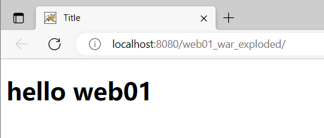
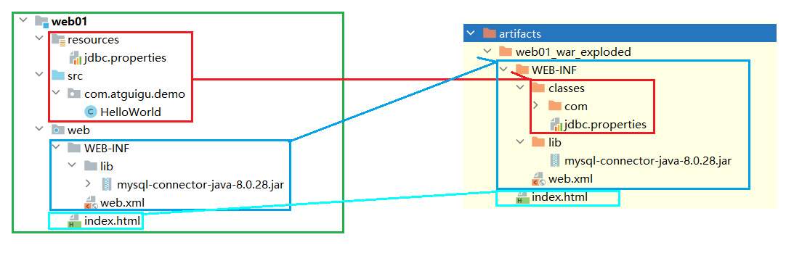

> 检查idea是否识别modules为web项目并存在将项目构建成发布结构的配置

+ 就是检查工程目录下，web目录有没有特殊的识别标记

+ 以及artifacts下，有没有对应 _war_exploded，如果没有，就点击+号添加

> 点击向下箭头，出现 Edit Configurations选项

> 出现运行配置界面

> 点击+号，添加本地tomcat服务器

> 因为IDEA 只关联了一个Tomcat，红色部分就只有一个Tomcat可选

> 选择Deployment，通过+添加要部署到 Tomcat 中的 artifact

> applicationContext 中是默认的项目上下文路径，也就是url中需要输入的路径，这里可以自己定义，可以和工程名称不一样，也可以不写，但是要保留 `/`，我们这里暂时就用默认的

> 点击 apply 应用后，回到 Server 部分。`After Launch` 是配置启动成功后，是否默认自动打开浏览器并输入 `URL` 中的地址，HTTP port 是 Http 连接器目前占用的端口号

> 点击OK后，启动项目，访问测试

+ 绿色箭头是正常运行模式
+ "小虫子"是debug运行模式

+ 点击后，查看日志状态是否有异常

+ 浏览器自动打开并自动访问了 `index.html` 欢迎页

> 工程结构和可以发布的项目结构之间的目录对应关系

### IDEA部署并运行项目的原理
+ `idea` 并没有直接进将编译好的项目放入 `tomcat` 的 `webapps`中
+ `idea` 根据关联的 `tomcat`，创建了一个 `tomcat` 副本，将项目部署到了这个副本中
+ `idea` 的 `tomcat` 副本在 `C:\用户\当前用户\AppData\Local\JetBrains\IntelliJIdea2022.2\tomcat\` 中
+ `idea` 的 `tomcat` 副本并不是一个完整的 `tomcat`，副本里只是准备了和当前项目相关的配置文件而已
+ `idea` 启动 `tomcat` 时，是让本地 `tomcat` 程序按照 `tomcat` 副本里的配置文件运行
+ `idea` 的 `tomcat` 副本部署项目的模式是通过 `conf/Catalina/localhost/*.xml` 配置文件的形式实现项目部署的

