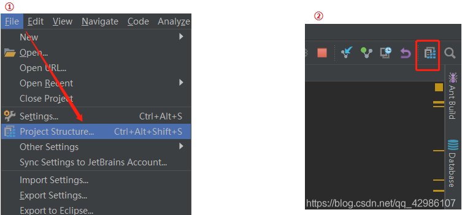
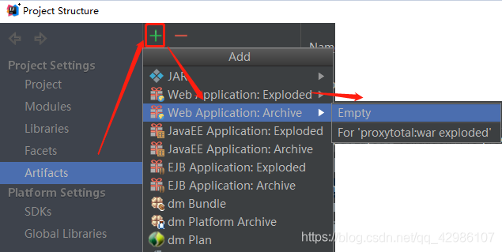
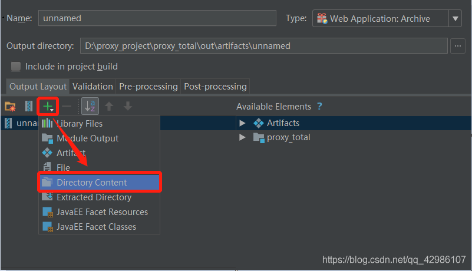
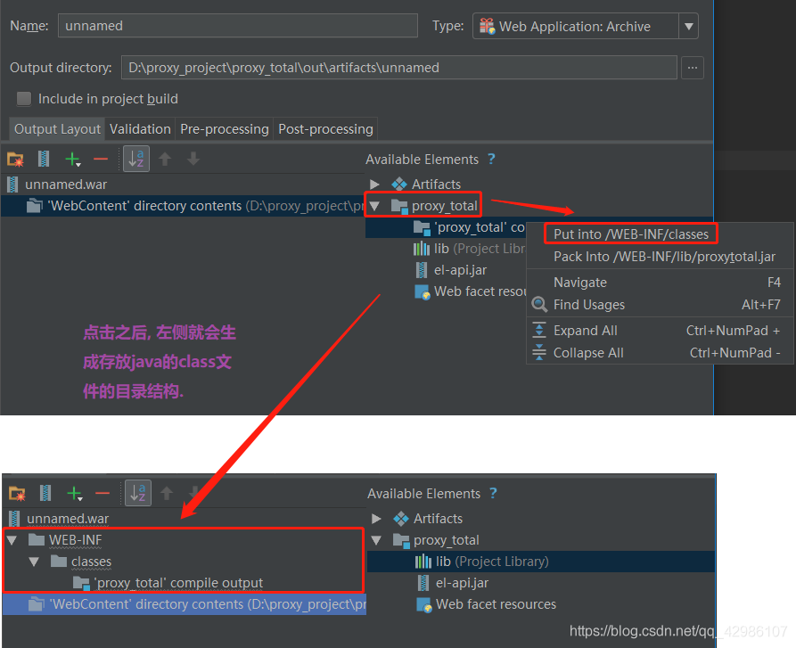

# IDEA 中进行 war 的配置
> **參考文章：**
> - [IDEA中如何将一个JavaWeb项目打成war包](https://blog.csdn.net/dante1987/article/details/122305789 "IDEA中如何将一个JavaWeb项目打成war包")

> 一个项目中，没有用到 `maven`，所以不能在 `maven` 窗口进行项目打包，这时候用 idea 操作有点懵逼，所以网上找了一下别人的操作

1. 首先打开 `【Project Structure】` 窗口，进行 war 的配置。 ( 两种方式 )
    

2. 选择左侧的 `【Artifacts】` 页签，添加一个 `【Empty】` 的 `【Web Application:Archive】`。
    

3. 点击 `+` 号，选择 `【Directory Content】`，然后找到自己项目的 Web 根目录，点击OK即可。
    

4. 在 `/WEB-INF/classes` 目录下，生成编译后的 class 文件。
    

    > **注:** 点击 `apply -> ok`，此时 `war` 包就配置好了.

5. 将项目进行打包。
    - 点击 `【Build】` -> `【BuildArtifacts】` -> `【Build】` 菜单，找到自己更才部署的项目，进行打包即可。

    > **注:** 打包完成之后，去配置 `war` 时指定的目录下查找即可。