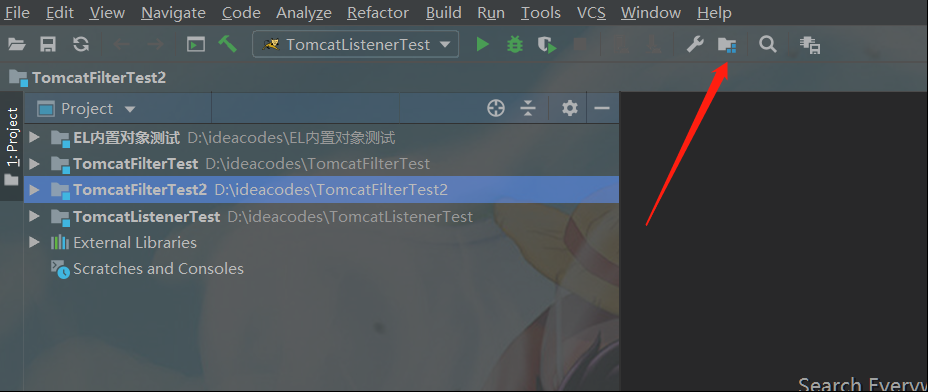
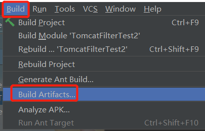
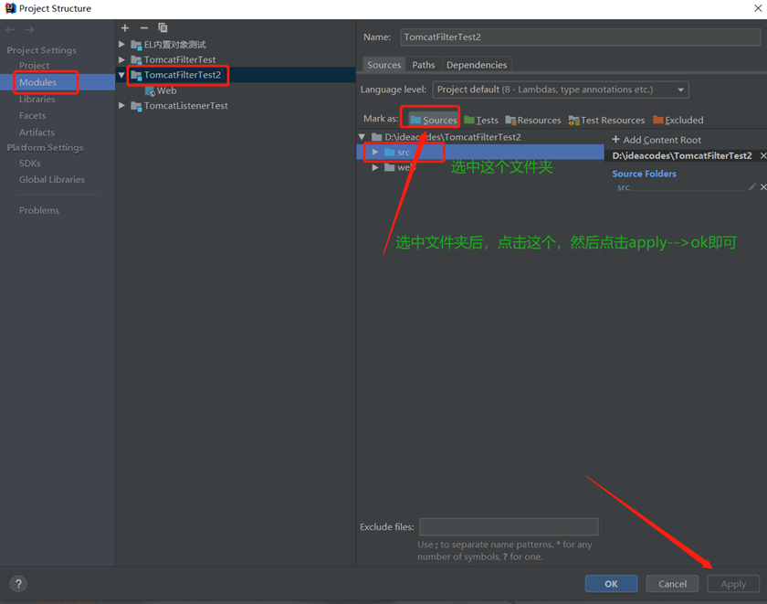

# 前言
> **參考文章：**
> - [idea如何打war包（不使用maven）](https://www.cnblogs.com/ljfsmile0613/p/13462257.html "idea如何打war包（不使用maven）")
> - [IDEA 将项目打包war包](https://blog.csdn.net/github_38336924/article/details/82422888 "IDEA 将项目打包war包")
> - [【bug】idea打war包缺少class文件（classes目录为空）](https://www.cnblogs.com/hdxg/p/14582463.html "【bug】idea打war包缺少class文件（classes目录为空）")

用多了maven的小伙伴，应该快忘了怎么不用maven打war包了吧，我也快忘了，所以趁我还记得，赶紧记录下来，多年后，当我回忆起往事........

而且网上的教程也太坑了吧，牛头不搭马嘴，这害死多少人啊，可能是我理解能力不好吧，怪我。

 这里以打包 web 工程：`TomcatFilterTest2` 为例

# 第一步：进入打包界面，下面两种方法，选其一

### Ps:有点人的工具栏可能是这样的：

那是因为你没有勾选视图view下的工具条：

# 第二步，点击 `Artifacts`
> `Artifacts` 是工程组件的意思。可以理解为一个工程中的各个模块。（ps：如果你要打包的web的工程在idea的tomcat部署运行过，那么就会出现，例如下图，我要打包的模块在tomcat运行过，所以会有所记录，有记录的建议跳过第三步，直接看第四步）

# 第三步，手动选择需要打包的模块

选择要打包的模块：`TomcatFilterTest2`，然后点击ok

这样就出现了刚刚选择的模块在Artifacts里面了

# 第四步：这里的 Archive 是档案馆的意思，我们打war包就是为了存档起来嘛，也就是打war的意思，然后选择我们刚刚选择的那个模块

- **Name:** 是war包的名字，可以自己随意定义

- **Type:** 是类型，这里是Archive的类型，也就是war包的类型

- **Output directory:** 是war包存储的位置，可以随意修改，找一个好找的位置存储即可

- **Include in project build:** 如果把这个选项勾选，说明当当前的这个模块修改了代码或者啥的，重新编译了之后，这个war包也会同步更新修改

- **Output Layout:** 是输出布局，也就是war包的目录结构，这里选择了TomcatFilterTest2模块，自然war包最后的结构是和TomcatFilterTest2模块的webapps下的目录结构是一样的。

> 其他的选项作用不是那么大，况且我也不是那么清楚，就不介绍了。至于左下角的提示：`META-INF/MANIFEST.MF` 文件没找到也不必理会，这个文件里主要存储了主类，也就是有main方法那个类的所在的位置，这个文件对于java普通工程的打jar包有用，对于打war包，有没有都不影响，所以这里直接选择：`Apply -> ok`

# 第五步：编译war包

- **All Artifact:** 对所有模块进行操作

- **Build:** 进行编译打包

- **Rebuild:** 重现编译打包，会删除原来的war包，然后编译打包

- **Clean:** 清除war包

- **Edit:** 重新编辑war包的设置

这里我们选择刚刚的war包，然后点击Build，查看idea信息窗口：

提示编辑已经成功完成后，可以到打包输出文件夹查看war包了

对比：

这个iml文件是这个模块在idea中的一个配置文件，里面主要记录了这个模块与当前工程的一个绑定信息（相等于工程给模块颁发的一个身份证吧），在打war包的时候是不会打包进去的。

 

对比目录，可以发现，多了一个 `classes` 文件夹，这个 `classes` 文件夹是打包的时候自动帮我们创建的，主要存放的是 `src` 目录下对应的类的 `class` 文件，当部署到服务器的时候，服务器就会从这个文件夹中读取可执行的类文件。如果我们自己手动在 `WEB-INF` 下建一个 `classes` 文件夹的话，那么打包的时候，检测到已经有这个文件夹就不会再创建，然后把 `src` 对应结构下的类编译，然后把 `class` 文件存储进去。

经过 `war` 包与 `src` 目录下的结构对比，知道 `web` 默认的目录结构还是挺重要的，因为在打包的时候，`idea` 会去找 `src` 目录下的对应的类进行编译。

如果 `src` 不是源目录，也可以但是名字必须叫：`src`，这样打包的时候也会去 `src` 目录下面找对应的类编译然后将 `class` 文件存储进`classes` 文件夹中
如果不想叫 `src` 目录，也可以，但是必须将这个文件夹定义为源目录：这样也可以找得到。但是！如果你既不定义目录名为 `src` 又不定义这个名字不为 `src` 的目录为根目录，那么打包的时候，就不知道从哪里找文件了，`classes` 文件夹中就会是空的。那将 `war` 包部署到服务器的时候就会报找不到文件的错误

那么如何设置文件夹为根目录呢？

对要设置为根目录的文件夹右键：

或者：

顺便再说一句，所以我们在创建 web 项目的时候，在 `WEB-INF` 下创建 `classes` 目录是没有必要的，因为打包的时候会自动帮我们添加上，但是也可以指定项目运行时的编译输出路径吧，方便查看嘛。

`war` 包的内容都是从 `exploded` 里面复制的，所以啊如果 `war` 包打包发现少东西了，一般都是这个 `exploded` 里少了，需要手动粘贴缺少的文件到 `exploded` 中，再重新打包。一般我们部署文件到浏览器进行测试的时候，都是部署 `exploed` 文件，因为这个文件有着 `war` 包一样的目录结构（其实 `war` 包就是按照这个文件的内容打包的，能不一样吗），但它更易于修改，在测试的时候我们都需要频繁的修改代码，如果使用 `war` 包，修改的速度会慢些，并且修改后不太容易看见 `war` 包里面的修改情况。所以一般都用 `exploded` 类型测试，等到测试完毕后，再进行最后的打 `war` 包。至于更进一步的区别，可以去百度一下。

我们还没打 `war` 包的时候，在idea上部署到服务器的就是 `exploded` 类型。如果我们在idea模块中添加了文件，但是在运行的时候发现找不到文件，这个时候就需要到 `exploded` 所在的文件看下这个文件在不在，一般都是没有对这个 `exploded` 文件及时进行更新导致的。

jar包和war包的区别可以参考以下链接：https://www.cnblogs.com/lvhouhou/p/11907738.html

# 既然war包已经打好，那么如何手动部署运行呢？

首先启动服务器，这里是启动 `tomcat` 服务器，然后复制打包好的 `war` 到 `tomcat` 目录下的 `webapps` 文件夹下，即可自动解压 `war` 包，并自动运行。

那么，这个原理又是什么，为什么只要复制 `war` 包到这里就能自动解压和自动部署，这就要看 `tomcat` 目录的 `conf` 文件夹下的 `server.xml` 配置了：

- **name:** 配置主机名

- **appBase:** 这里写相对于 `servlet.xml` 所在文件夹也就是 `conf` 文件夹的相对路径，也就是应用的主要目录，每次访问这个主机，都会到这个主要目录找可执行的 `web` 应用，所以要将 `war` 包复制到 `webapps`这个文件夹里

- **unpackWARs:** 设置`appBase` 文件夹下的应用是否打包，这里是 `true`,说明了主要我们复制 `war`包过来，就会自动帮我们解压

- **autoDeploy:** 是否自动部署，这里也是 `true`,只要有 `web`项目，就会自动的帮我们部署到服务器